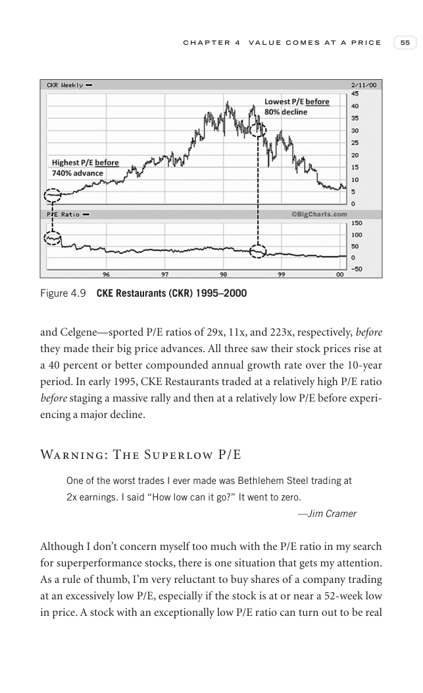

# Trade Like a Stock Market Wizard - Page Image 70

## Source Page

Book: [[Trade Like a Stock Market Wizard]]

## Page Read

Tags: manual-review-needed, stock-chart-page

Concepts: [[Mental Discipline]]

This page contains one or more stock-chart figures already reconciled in the stock-image layer. Study the source page first for the visual lesson, then open the linked case notes to compare it against rebuilt OHLCV data.

## Linked Stock Figures

- [[Trade Like a Stock Market Wizard - Figure 4-9 - CKR - page 70]] - CKR - manual-review-needed

## Extracted Page Text Signal

C H A P T E R 4 V A L U E C O M E S A T A P R I C E 55 and Celgene-sported P/E ratios of 29x, 11x, and 223x, respectively, before they made their big price advances. All three saw their stock prices rise at a 40 percent or better compounded annual growth rate over the 10-year period. In early 1995, CKE Restaurants traded at a relatively high P/E ratio before staging a massive rally and then at a relatively low P/E before experi- encing a major decline. Warning: The Superlow P/E One of the worst ...

## Manual Study Prompt

- What visual structure is the page trying to make obvious?
- Is the lesson about buying, avoiding, selling, or managing risk?
- If a ticker is not present, what generic behavior does the image teach?
- If a ticker is present, does the linked OHLCV rebuild confirm the same behavior?
