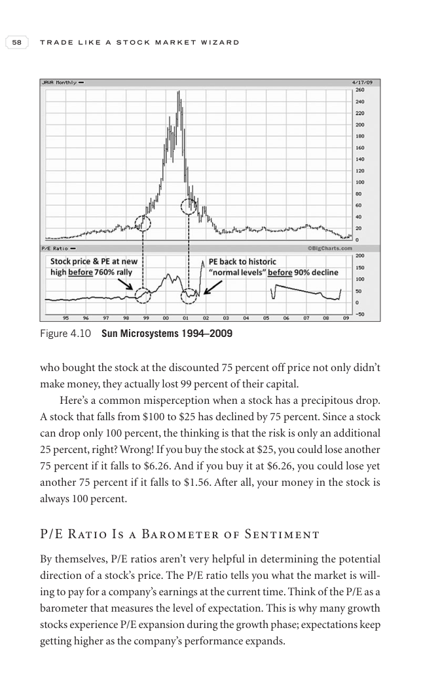

# Trade Like a Stock Market Wizard - Page Image 73

## Source Page

Book: [[Trade Like a Stock Market Wizard]]

## Page Read

Tags: manual-review-needed, risk-first, stock-chart-page

Concepts: [[Mental Discipline]], [[Risk First]]

This page contains one or more stock-chart figures already reconciled in the stock-image layer. Study the source page first for the visual lesson, then open the linked case notes to compare it against rebuilt OHLCV data.

## Linked Stock Figures

- [[Trade Like a Stock Market Wizard - Figure 4-10 - manual-review - page 73]] - manual - manual-review-needed

## Extracted Page Text Signal

58 T R A D E L I K E A S T O C K M A R K E T W I Z A R D who bought the stock at the discounted 75 percent off price not only didn’t make money, they actually lost 99 percent of their capital. Here’s a common misperception when a stock has a precipitous drop. A stock that falls from $100 to $25 has declined by 75 percent. Since a stock can drop only 100 percent, the thinking is that the risk is only an additional 25 percent, right? Wrong! If you buy the stock at $25, you could lose another 75 pe...

## Manual Study Prompt

- What visual structure is the page trying to make obvious?
- Is the lesson about buying, avoiding, selling, or managing risk?
- If a ticker is not present, what generic behavior does the image teach?
- If a ticker is present, does the linked OHLCV rebuild confirm the same behavior?
