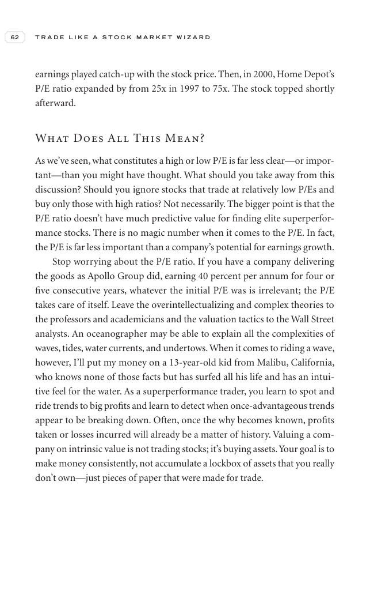

# Trade Like a Stock Market Wizard - Page Image 77

## Source Page

Book: [[Trade Like a Stock Market Wizard]]

## Page Read

Tags: risk-first, visual-concept-page

Concepts: [[Mental Discipline]], [[Risk First]]

This is a visual teaching page without a clean ticker/date case. The useful work is to read the image as a concept illustration rather than forcing a market-data reconstruction.

## Linked Stock Figures

- No extracted stock-figure case on this page.

## Extracted Page Text Signal

62 T R A D E L I K E A S T O C K M A R K E T W I Z A R D earnings played catch-up with the stock price. Then, in 2000, Home Depot’s P/E ratio expanded by from 25x in 1997 to 75x. The stock topped shortly afterward. What Does All This Mean? As we’ve seen, what constitutes a high or low P/E is far less clear-or impor- tant-than you might have thought. What should you take away from this discussion? Should you ignore stocks that trade at relatively low P/Es and buy only those with high ratios? Not ...

## Manual Study Prompt

- What visual structure is the page trying to make obvious?
- Is the lesson about buying, avoiding, selling, or managing risk?
- If a ticker is not present, what generic behavior does the image teach?
- If a ticker is present, does the linked OHLCV rebuild confirm the same behavior?
