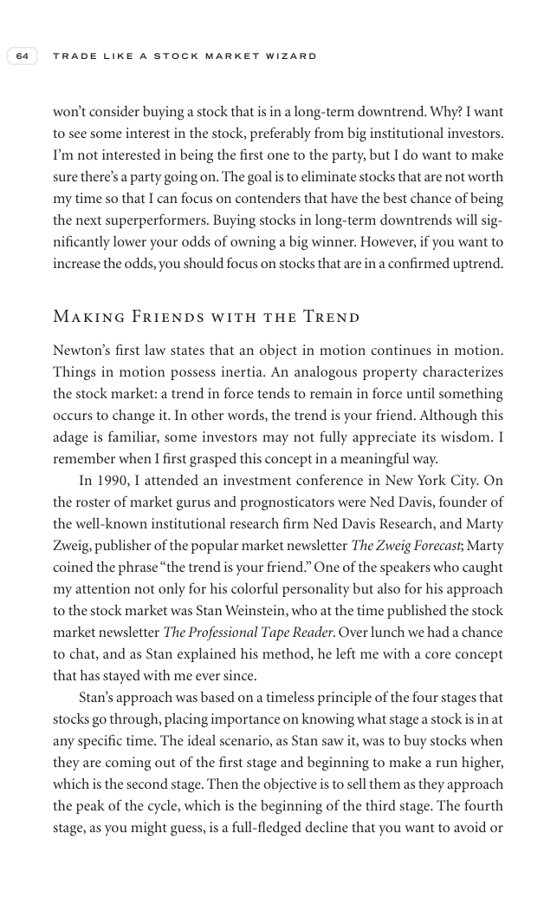

# Trade Like a Stock Market Wizard - Page Image 79

## Source Page

Book: [[Trade Like a Stock Market Wizard]]

## Page Read

Tags: visual-concept-page

Concepts: [[Mental Discipline]]

This is a visual teaching page without a clean ticker/date case. The useful work is to read the image as a concept illustration rather than forcing a market-data reconstruction.

## Linked Stock Figures

- No extracted stock-figure case on this page.

## Extracted Page Text Signal

64 T R A D E L I K E A S T O C K M A R K E T W I Z A R D won’t consider buying a stock that is in a long-term downtrend. Why? I want to see some interest in the stock, preferably from big institutional investors. I’m not interested in being the first one to the party, but I do want to make sure there’s a party going on. The goal is to eliminate stocks that are not worth my time so that I can focus on contenders that have the best chance of being the next superperformers. Buying stocks in long-ter...

## Manual Study Prompt

- What visual structure is the page trying to make obvious?
- Is the lesson about buying, avoiding, selling, or managing risk?
- If a ticker is not present, what generic behavior does the image teach?
- If a ticker is present, does the linked OHLCV rebuild confirm the same behavior?
