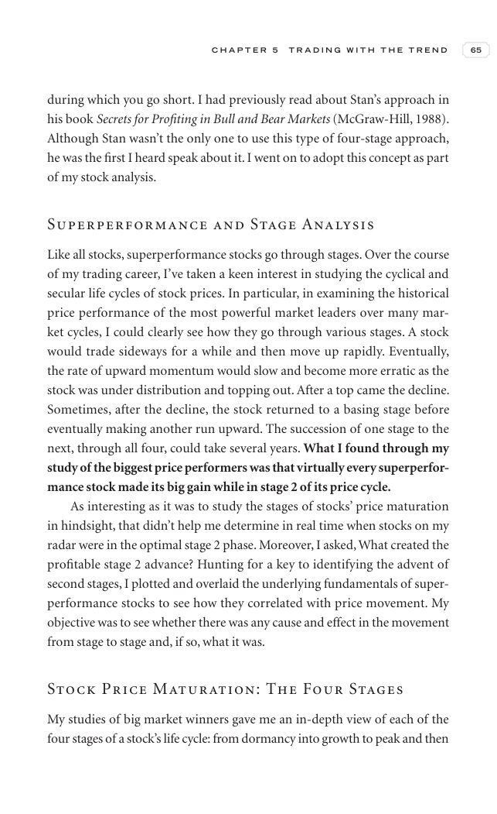

# Trade Like a Stock Market Wizard - Page Image 80

## Source Page

Book: [[Trade Like a Stock Market Wizard]]

## Page Read

Tags: stage-2-uptrend, visual-concept-page

Concepts: [[Mental Discipline]], [[Stage 2 Uptrend]]

This is a visual teaching page without a clean ticker/date case. The useful work is to read the image as a concept illustration rather than forcing a market-data reconstruction.

## Linked Stock Figures

- No extracted stock-figure case on this page.

## Extracted Page Text Signal

C H A P T E R 5 T R A D I N G W I T H T H E T R E N D 65 during which you go short. I had previously read about Stan’s approach in his book Secrets for Profiting in Bull and Bear Markets (McGraw-Hill, 1988). Although Stan wasn’t the only one to use this type of four-stage approach, he was the first I heard speak about it. I went on to adopt this concept as part of my stock analysis. Superperformance and Stage Analysis Like all stocks, superperformance stocks go through stages. Over the course of m...

## Manual Study Prompt

- What visual structure is the page trying to make obvious?
- Is the lesson about buying, avoiding, selling, or managing risk?
- If a ticker is not present, what generic behavior does the image teach?
- If a ticker is present, does the linked OHLCV rebuild confirm the same behavior?
