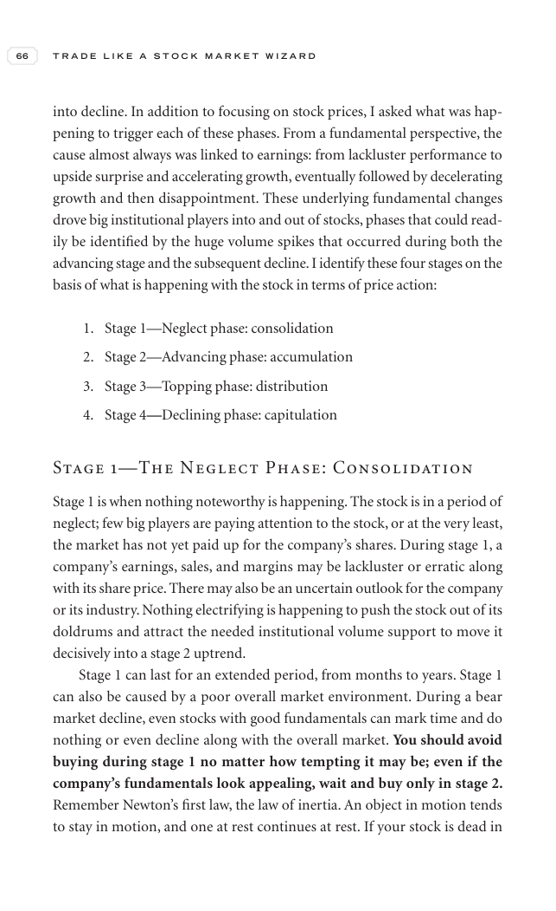

# Trade Like a Stock Market Wizard - Page Image 81

## Source Page

Book: [[Trade Like a Stock Market Wizard]]

## Page Read

Tags: stage-2-uptrend, visual-concept-page, volume-behavior

Concepts: [[Mental Discipline]], [[Stage 2 Uptrend]], [[Volume Dry-Up and Accumulation]]

This is a visual teaching page without a clean ticker/date case. The useful work is to read the image as a concept illustration rather than forcing a market-data reconstruction.

## Linked Stock Figures

- No extracted stock-figure case on this page.

## Extracted Page Text Signal

66 T R A D E L I K E A S T O C K M A R K E T W I Z A R D into decline. In addition to focusing on stock prices, I asked what was hap- pening to trigger each of these phases. From a fundamental perspective, the cause almost always was linked to earnings: from lackluster performance to upside surprise and accelerating growth, eventually followed by decelerating growth and then disappointment. These underlying fundamental changes drove big institutional players into and out of stocks, phases that c...

## Manual Study Prompt

- What visual structure is the page trying to make obvious?
- Is the lesson about buying, avoiding, selling, or managing risk?
- If a ticker is not present, what generic behavior does the image teach?
- If a ticker is present, does the linked OHLCV rebuild confirm the same behavior?
