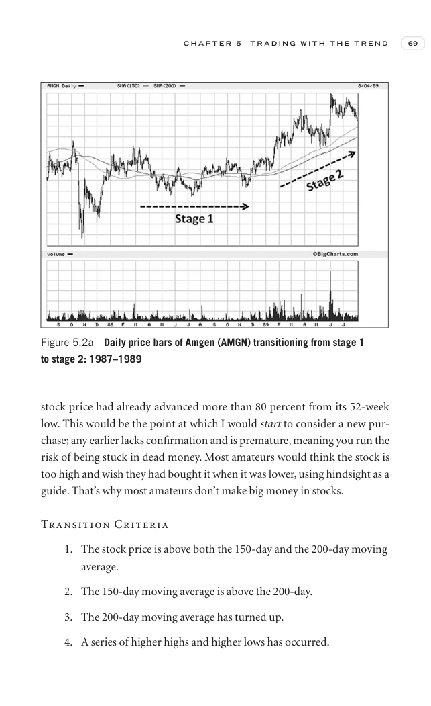

# Trade Like a Stock Market Wizard - Page Image 84

## Source Page

Book: [[Trade Like a Stock Market Wizard]]

## Page Read

Tags: manual-figure-page, risk-first, stage-2-uptrend

Concepts: [[Mental Discipline]], [[Risk First]], [[Stage 2 Uptrend]]

This page contains figure language, but the ticker/date was not extractable from the caption text. Treat it as a manual visual case: identify the shape, decide whether it is a buy setup or an avoid/sell lesson, and only promote it to a trade template after a ticker/date can be reconciled.

## Linked Stock Figures

- No extracted stock-figure case on this page.

## Extracted Page Text Signal

C H A P T E R 5 T R A D I N G W I T H T H E T R E N D 69 stock price had already advanced more than 80 percent from its 52-week low. This would be the point at which I would start to consider a new pur- chase; any earlier lacks confirmation and is premature, meaning you run the risk of being stuck in dead money. Most amateurs would think the stock is too high and wish they had bought it when it was lower, using hindsight as a guide. That’s why most amateurs don’t make big money in stocks. Transit...

## Manual Study Prompt

- What visual structure is the page trying to make obvious?
- Is the lesson about buying, avoiding, selling, or managing risk?
- If a ticker is not present, what generic behavior does the image teach?
- If a ticker is present, does the linked OHLCV rebuild confirm the same behavior?
