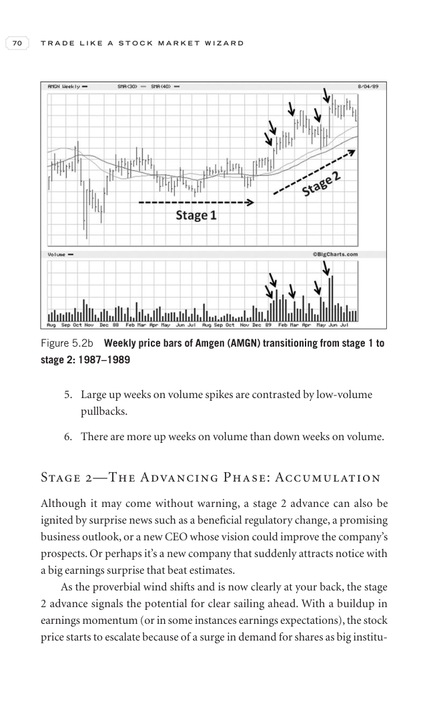

# Trade Like a Stock Market Wizard - Page Image 85

## Source Page

Book: [[Trade Like a Stock Market Wizard]]

## Page Read

Tags: manual-figure-page, stage-2-uptrend, volume-behavior

Concepts: [[Mental Discipline]], [[Stage 2 Uptrend]], [[Volume Dry-Up and Accumulation]]

This page contains figure language, but the ticker/date was not extractable from the caption text. Treat it as a manual visual case: identify the shape, decide whether it is a buy setup or an avoid/sell lesson, and only promote it to a trade template after a ticker/date can be reconciled.

## Linked Stock Figures

- No extracted stock-figure case on this page.

## Extracted Page Text Signal

70 T R A D E L I K E A S T O C K M A R K E T W I Z A R D 5. Large up weeks on volume spikes are contrasted by low-volume pullbacks. 6. There are more up weeks on volume than down weeks on volume. Stage 2-The Advancing Phase: Accumulation Although it may come without warning, a stage 2 advance can also be ignited by surprise news such as a beneficial regulatory change, a promising business outlook, or a new CEO whose vision could improve the company’s prospects. Or perhaps it’s a new company that ...

## Manual Study Prompt

- What visual structure is the page trying to make obvious?
- Is the lesson about buying, avoiding, selling, or managing risk?
- If a ticker is not present, what generic behavior does the image teach?
- If a ticker is present, does the linked OHLCV rebuild confirm the same behavior?
