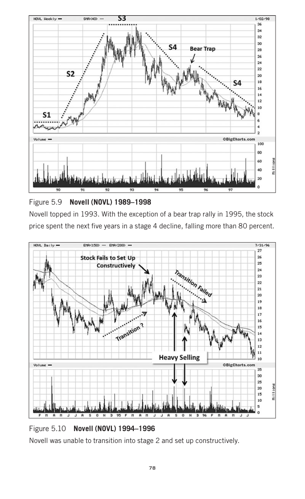

# Trade Like a Stock Market Wizard - Page Image 93

## Source Page

Book: [[Trade Like a Stock Market Wizard]]

## Page Read

Tags: manual-review-needed, stage-2-uptrend, stock-chart-page

Concepts: [[Mental Discipline]], [[Stage 2 Uptrend]]

This page contains one or more stock-chart figures already reconciled in the stock-image layer. Study the source page first for the visual lesson, then open the linked case notes to compare it against rebuilt OHLCV data.

## Linked Stock Figures

- [[Trade Like a Stock Market Wizard - Figure 5-9 - NOVL - page 93]] - NOVL - manual-review-needed
- [[Trade Like a Stock Market Wizard - Figure 5-10 - NOVL - page 93]] - NOVL - manual-review-needed

## Extracted Page Text Signal

78 Figure 5.9 Novell (NOVL) 1989-1998 Novell topped in 1993. With the exception of a bear trap rally in 1995, the stock price spent the next five years in a stage 4 decline, falling more than 80 percent. Figure 5.10 Novell (NOVL) 1994-1996 Novell was unable to transition into stage 2 and set up constructively

## Manual Study Prompt

- What visual structure is the page trying to make obvious?
- Is the lesson about buying, avoiding, selling, or managing risk?
- If a ticker is not present, what generic behavior does the image teach?
- If a ticker is present, does the linked OHLCV rebuild confirm the same behavior?
