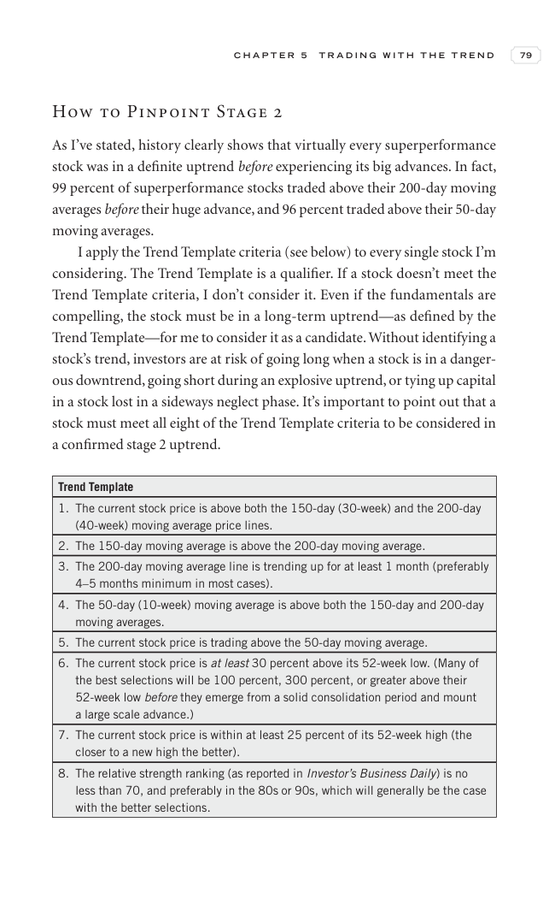

# Trade Like a Stock Market Wizard - Page Image 94

## Source Page

Book: [[Trade Like a Stock Market Wizard]]

## Page Read

Tags: risk-first, stage-2-uptrend, trend-template, visual-concept-page

Concepts: [[Mental Discipline]], [[Risk First]], [[Stage 2 Uptrend]], [[Trend Template]]

This is a visual teaching page without a clean ticker/date case. The useful work is to read the image as a concept illustration rather than forcing a market-data reconstruction.

## Linked Stock Figures

- No extracted stock-figure case on this page.

## Extracted Page Text Signal

C H A P T E R 5 T R A D I N G W I T H T H E T R E N D 79 How to Pinpoint Stage 2 As I’ve stated, history clearly shows that virtually every superperformance stock was in a definite uptrend before experiencing its big advances. In fact, 99 percent of superperformance stocks traded above their 200-day moving averages before their huge advance, and 96 percent traded above their 50-day moving averages. I apply the Trend Template criteria (see below) to every single stock I’m considering. The Trend Te...

## Manual Study Prompt

- What visual structure is the page trying to make obvious?
- Is the lesson about buying, avoiding, selling, or managing risk?
- If a ticker is not present, what generic behavior does the image teach?
- If a ticker is present, does the linked OHLCV rebuild confirm the same behavior?
