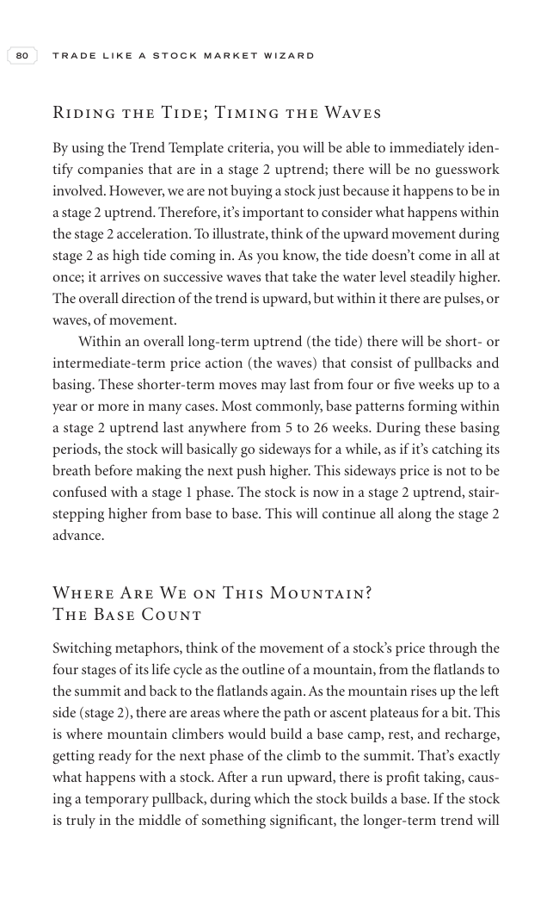

# Trade Like a Stock Market Wizard - Page Image 95

## Source Page

Book: [[Trade Like a Stock Market Wizard]]

## Page Read

Tags: stage-2-uptrend, trend-template, visual-concept-page

Concepts: [[Mental Discipline]], [[Stage 2 Uptrend]], [[Trend Template]]

This is a visual teaching page without a clean ticker/date case. The useful work is to read the image as a concept illustration rather than forcing a market-data reconstruction.

## Linked Stock Figures

- No extracted stock-figure case on this page.

## Extracted Page Text Signal

80 T R A D E L I K E A S T O C K M A R K E T W I Z A R D Riding the Tide; Timing the Waves By using the Trend Template criteria, you will be able to immediately iden- tify companies that are in a stage 2 uptrend; there will be no guesswork involved. However, we are not buying a stock just because it happens to be in a stage 2 uptrend. Therefore, it’s important to consider what happens within the stage 2 acceleration. To illustrate, think of the upward movement during stage 2 as high tide coming ...

## Manual Study Prompt

- What visual structure is the page trying to make obvious?
- Is the lesson about buying, avoiding, selling, or managing risk?
- If a ticker is not present, what generic behavior does the image teach?
- If a ticker is present, does the linked OHLCV rebuild confirm the same behavior?
