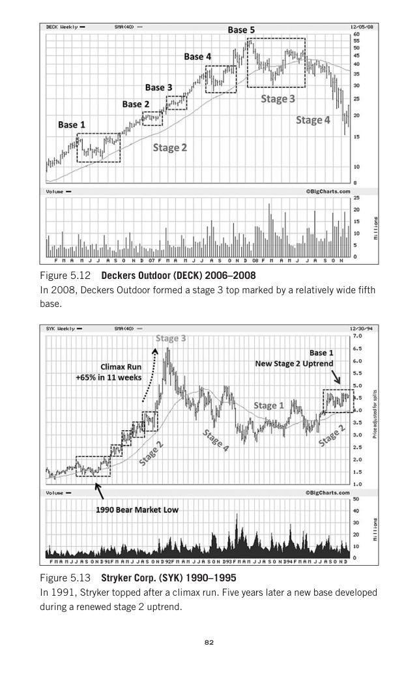

# Trade Like a Stock Market Wizard - Page Image 97

## Source Page

Book: [[Trade Like a Stock Market Wizard]]

## Page Read

Tags: climax-or-exhaustion, stage-2-leadership, stage-2-uptrend, stock-chart-page, vcp-or-tightening, volume-dry-up

Concepts: [[Pivot and Entry]], [[Relative Strength Leadership]], [[Sell Rules and Failure Signals]], [[Stage 2 Uptrend]], [[Trend Template]], [[Volatility Contraction Pattern]], [[Volume Dry-Up and Accumulation]]

This page contains one or more stock-chart figures already reconciled in the stock-image layer. Study the source page first for the visual lesson, then open the linked case notes to compare it against rebuilt OHLCV data.

## Linked Stock Figures

- [[Trade Like a Stock Market Wizard - Figure 5-12 - DECK - page 97]] - DECK - vcp-or-tightening; stage-2-leadership
- [[Trade Like a Stock Market Wizard - Figure 5-13 - SYK - page 97]] - SYK - vcp-or-tightening; volume-dry-up; climax-or-exhaustion; stage-2-leadership

## Extracted Page Text Signal

82 Figure 5.12 Deckers Outdoor (DECK) 2006-2008 In 2008, Deckers Outdoor formed a stage 3 top marked by a relatively wide fifth base. Figure 5.13 Stryker Corp. (SYK) 1990-1995 In 1991, Stryker topped after a climax run. Five years later a new base developed during a renewed stage 2 uptrend

## Manual Study Prompt

- What visual structure is the page trying to make obvious?
- Is the lesson about buying, avoiding, selling, or managing risk?
- If a ticker is not present, what generic behavior does the image teach?
- If a ticker is present, does the linked OHLCV rebuild confirm the same behavior?
