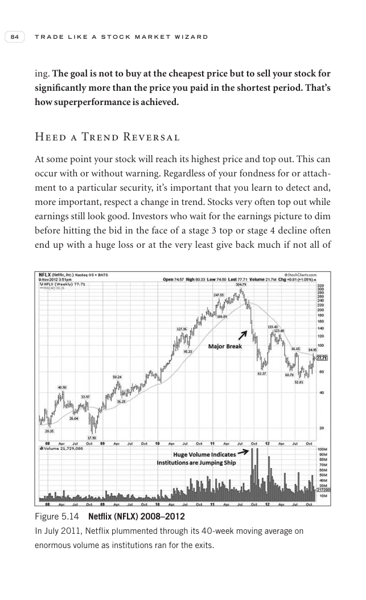

# Trade Like a Stock Market Wizard - Page Image 99

## Source Page

Book: [[Trade Like a Stock Market Wizard]]

## Page Read

Tags: sell-or-failure, stage-2-leadership, stock-chart-page, vcp-or-tightening, volume-behavior

Concepts: [[Pivot and Entry]], [[Relative Strength Leadership]], [[Sell Rules and Failure Signals]], [[Stage 2 Uptrend]], [[Trend Template]], [[Volatility Contraction Pattern]], [[Volume Dry-Up and Accumulation]]

This page contains one or more stock-chart figures already reconciled in the stock-image layer. Study the source page first for the visual lesson, then open the linked case notes to compare it against rebuilt OHLCV data.

## Linked Stock Figures

- [[Trade Like a Stock Market Wizard - Figure 5-14 - NFLX - page 99]] - NFLX - vcp-or-tightening; stage-2-leadership

## Extracted Page Text Signal

84 T R A D E L I K E A S T O C K M A R K E T W I Z A R D ing. The goal is not to buy at the cheapest price but to sell your stock for significantly more than the price you paid in the shortest period. That’s how superperformance is achieved. Heed a Trend Reversal At some point your stock will reach its highest price and top out. This can occur with or without warning. Regardless of your fondness for or attach- ment to a particular security, it’s important that you learn to detect and, more import...

## Manual Study Prompt

- What visual structure is the page trying to make obvious?
- Is the lesson about buying, avoiding, selling, or managing risk?
- If a ticker is not present, what generic behavior does the image teach?
- If a ticker is present, does the linked OHLCV rebuild confirm the same behavior?
