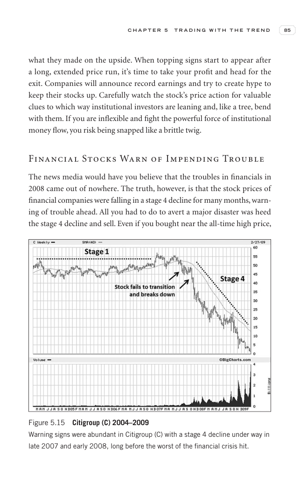

# Trade Like a Stock Market Wizard - Page Image 100

## Source Page

Book: [[Trade Like a Stock Market Wizard]]

## Page Read

Tags: manual-review-needed, risk-first, sell-or-failure, stock-chart-page

Concepts: [[Mental Discipline]], [[Risk First]], [[Sell Rules and Failure Signals]]

This page contains one or more stock-chart figures already reconciled in the stock-image layer. Study the source page first for the visual lesson, then open the linked case notes to compare it against rebuilt OHLCV data.

## Linked Stock Figures

- [[Trade Like a Stock Market Wizard - Figure 5-15 - manual-review - page 100]] - manual - manual-review-needed

## Extracted Page Text Signal

C H A P T E R 5 T R A D I N G W I T H T H E T R E N D 85 what they made on the upside. When topping signs start to appear after a long, extended price run, it’s time to take your profit and head for the exit. Companies will announce record earnings and try to create hype to keep their stocks up. Carefully watch the stock’s price action for valuable clues to which way institutional investors are leaning and, like a tree, bend with them. If you are inflexible and fight the powerful force of instituti...

## Manual Study Prompt

- What visual structure is the page trying to make obvious?
- Is the lesson about buying, avoiding, selling, or managing risk?
- If a ticker is not present, what generic behavior does the image teach?
- If a ticker is present, does the linked OHLCV rebuild confirm the same behavior?
