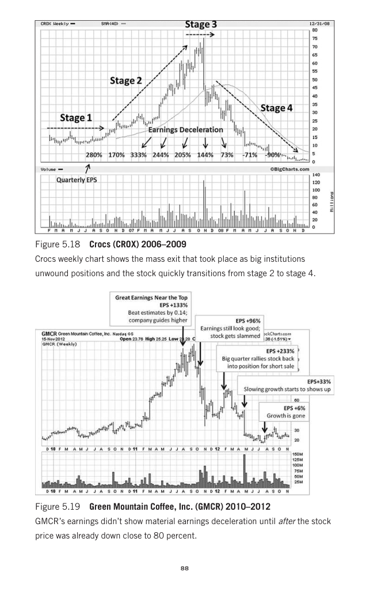

# Trade Like a Stock Market Wizard - Page Image 103

## Source Page

Book: [[Trade Like a Stock Market Wizard]]

## Page Read

Tags: failed-breakout-or-stage-4, manual-review-needed, stage-2-uptrend, stock-chart-page, vcp-or-tightening

Concepts: [[Mental Discipline]], [[Pivot and Entry]], [[Risk First]], [[Sell Rules and Failure Signals]], [[Stage 2 Uptrend]], [[Trend Template]], [[Volatility Contraction Pattern]], [[Volume Dry-Up and Accumulation]]

This page contains one or more stock-chart figures already reconciled in the stock-image layer. Study the source page first for the visual lesson, then open the linked case notes to compare it against rebuilt OHLCV data.

## Linked Stock Figures

- [[Trade Like a Stock Market Wizard - Figure 5-19 - GMCR - page 103]] - GMCR - manual-review-needed
- [[Trade Like a Stock Market Wizard - Figure 5-18 - CROX - page 103]] - CROX - vcp-or-tightening; failed-breakout-or-stage-4

## Extracted Page Text Signal

88 Figure 5.19 Green Mountain Coffee, Inc. (GMCR) 2010-2012 GMCR’s earnings didn’t show material earnings deceleration until after the stock price was already down close to 80 percent. Figure 5.18 Crocs (CROX) 2006-2009 Crocs weekly chart shows the mass exit that took place as big institutions unwound positions and the stock quickly transitions from stage 2 to stage 4

## Manual Study Prompt

- What visual structure is the page trying to make obvious?
- Is the lesson about buying, avoiding, selling, or managing risk?
- If a ticker is not present, what generic behavior does the image teach?
- If a ticker is present, does the linked OHLCV rebuild confirm the same behavior?
