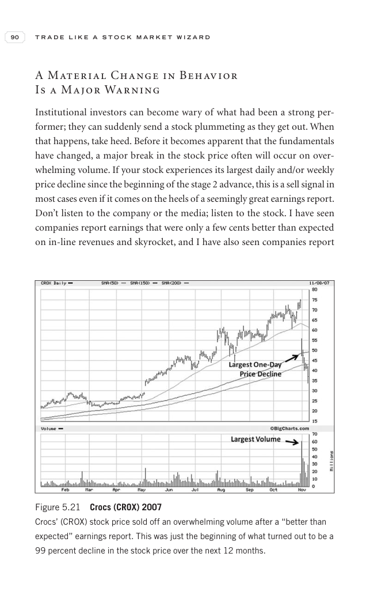

# Trade Like a Stock Market Wizard - Page Image 105

## Source Page

Book: [[Trade Like a Stock Market Wizard]]

## Page Read

Tags: failed-breakout-or-stage-4, sell-or-failure, stage-2-uptrend, stock-chart-page, volume-behavior

Concepts: [[Risk First]], [[Sell Rules and Failure Signals]], [[Stage 2 Uptrend]], [[Trend Template]], [[Volume Dry-Up and Accumulation]]

This page contains one or more stock-chart figures already reconciled in the stock-image layer. Study the source page first for the visual lesson, then open the linked case notes to compare it against rebuilt OHLCV data.

## Linked Stock Figures

- [[Trade Like a Stock Market Wizard - Figure 5-21 - CROX - page 105]] - CROX - failed-breakout-or-stage-4

## Extracted Page Text Signal

90 T R A D E L I K E A S T O C K M A R K E T W I Z A R D A Material Change in Behavior Is a Major Warning Institutional investors can become wary of what had been a strong per- former; they can suddenly send a stock plummeting as they get out. When that happens, take heed. Before it becomes apparent that the fundamentals have changed, a major break in the stock price often will occur on over- whelming volume. If your stock experiences its largest daily and/or weekly price decline since the begin...

## Manual Study Prompt

- What visual structure is the page trying to make obvious?
- Is the lesson about buying, avoiding, selling, or managing risk?
- If a ticker is not present, what generic behavior does the image teach?
- If a ticker is present, does the linked OHLCV rebuild confirm the same behavior?
