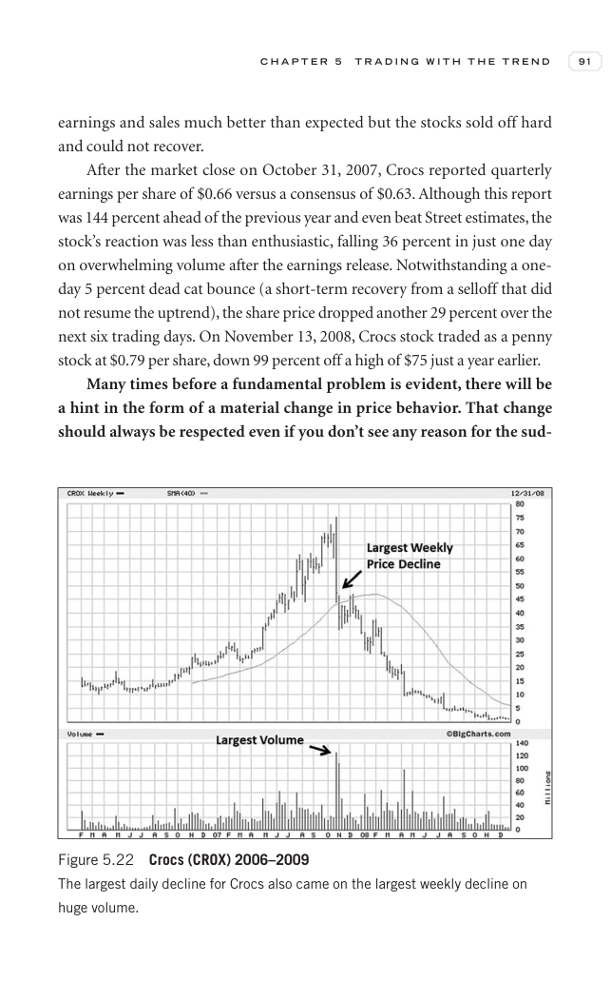

# Trade Like a Stock Market Wizard - Page Image 106

## Source Page

Book: [[Trade Like a Stock Market Wizard]]

## Page Read

Tags: failed-breakout-or-stage-4, sell-or-failure, stock-chart-page, vcp-or-tightening, volume-behavior

Concepts: [[Pivot and Entry]], [[Risk First]], [[Sell Rules and Failure Signals]], [[Trend Template]], [[Volatility Contraction Pattern]], [[Volume Dry-Up and Accumulation]]

This page contains one or more stock-chart figures already reconciled in the stock-image layer. Study the source page first for the visual lesson, then open the linked case notes to compare it against rebuilt OHLCV data.

## Linked Stock Figures

- [[Trade Like a Stock Market Wizard - Figure 5-22 - CROX - page 106]] - CROX - vcp-or-tightening; failed-breakout-or-stage-4

## Extracted Page Text Signal

C H A P T E R 5 T R A D I N G W I T H T H E T R E N D 91 earnings and sales much better than expected but the stocks sold off hard and could not recover. After the market close on October 31, 2007, Crocs reported quarterly earnings per share of $0.66 versus a consensus of $0.63. Although this report was 144 percent ahead of the previous year and even beat Street estimates, the stock’s reaction was less than enthusiastic, falling 36 percent in just one day on overwhelming volume after the earning...

## Manual Study Prompt

- What visual structure is the page trying to make obvious?
- Is the lesson about buying, avoiding, selling, or managing risk?
- If a ticker is not present, what generic behavior does the image teach?
- If a ticker is present, does the linked OHLCV rebuild confirm the same behavior?
