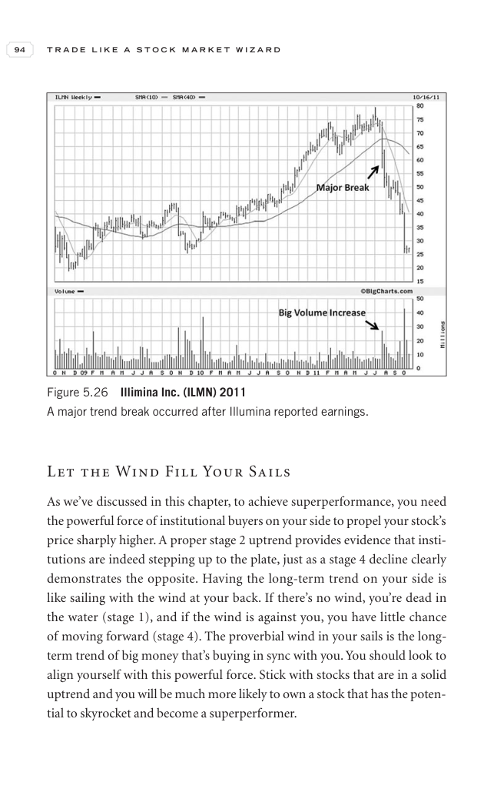

# Trade Like a Stock Market Wizard - Page Image 109

## Source Page

Book: [[Trade Like a Stock Market Wizard]]

## Page Read

Tags: stage-2-leadership, stage-2-uptrend, stock-chart-page, volume-dry-up

Concepts: [[Relative Strength Leadership]], [[Stage 2 Uptrend]], [[Trend Template]], [[Volume Dry-Up and Accumulation]]

This page contains one or more stock-chart figures already reconciled in the stock-image layer. Study the source page first for the visual lesson, then open the linked case notes to compare it against rebuilt OHLCV data.

## Linked Stock Figures

- [[Trade Like a Stock Market Wizard - Figure 5-26 - ILMN - page 109]] - ILMN - volume-dry-up; stage-2-leadership

## Extracted Page Text Signal

94 T R A D E L I K E A S T O C K M A R K E T W I Z A R D Let the Wind Fill Your Sails As we’ve discussed in this chapter, to achieve superperformance, you need the powerful force of institutional buyers on your side to propel your stock’s price sharply higher. A proper stage 2 uptrend provides evidence that insti- tutions are indeed stepping up to the plate, just as a stage 4 decline clearly demonstrates the opposite. Having the long-term trend on your side is like sailing with the wind at your ...

## Manual Study Prompt

- What visual structure is the page trying to make obvious?
- Is the lesson about buying, avoiding, selling, or managing risk?
- If a ticker is not present, what generic behavior does the image teach?
- If a ticker is present, does the linked OHLCV rebuild confirm the same behavior?
