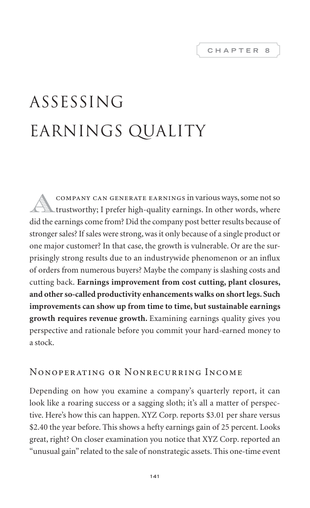

# Trade Like a Stock Market Wizard - Page Image 156

## Source Page

Book: [[Trade Like a Stock Market Wizard]]

## Page Read

Tags: visual-concept-page

Concepts: [[Mental Discipline]]

This is a visual teaching page without a clean ticker/date case. The useful work is to read the image as a concept illustration rather than forcing a market-data reconstruction.

## Linked Stock Figures

- No extracted stock-figure case on this page.

## Extracted Page Text Signal

141 C H A P T E R 8 Assessing Earnings Quality A company can generate earnings in various ways, some not so trustworthy; I prefer high-quality earnings. In other words, where did the earnings come from? Did the company post better results because of stronger sales? If sales were strong, was it only because of a single product or one major customer? In that case, the growth is vulnerable. Or are the sur- prisingly strong results due to an industrywide phenomenon or an influx of orders from numerou...

## Manual Study Prompt

- What visual structure is the page trying to make obvious?
- Is the lesson about buying, avoiding, selling, or managing risk?
- If a ticker is not present, what generic behavior does the image teach?
- If a ticker is present, does the linked OHLCV rebuild confirm the same behavior?
