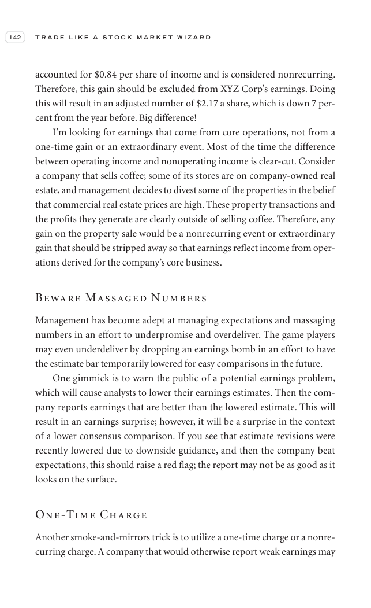

# Trade Like a Stock Market Wizard - Page Image 157

## Source Page

Book: [[Trade Like a Stock Market Wizard]]

## Page Read

Tags: sell-or-failure, visual-concept-page

Concepts: [[Mental Discipline]], [[Sell Rules and Failure Signals]]

This is a visual teaching page without a clean ticker/date case. The useful work is to read the image as a concept illustration rather than forcing a market-data reconstruction.

## Linked Stock Figures

- No extracted stock-figure case on this page.

## Extracted Page Text Signal

142 T R A D E L I K E A S T O C K M A R K E T W I Z A R D accounted for $0.84 per share of income and is considered nonrecurring. Therefore, this gain should be excluded from XYZ Corp’s earnings. Doing this will result in an adjusted number of $2.17 a share, which is down 7 per- cent from the year before. Big difference! I’m looking for earnings that come from core operations, not from a one-time gain or an extraordinary event. Most of the time the difference between operating income and nonoper...

## Manual Study Prompt

- What visual structure is the page trying to make obvious?
- Is the lesson about buying, avoiding, selling, or managing risk?
- If a ticker is not present, what generic behavior does the image teach?
- If a ticker is present, does the linked OHLCV rebuild confirm the same behavior?
