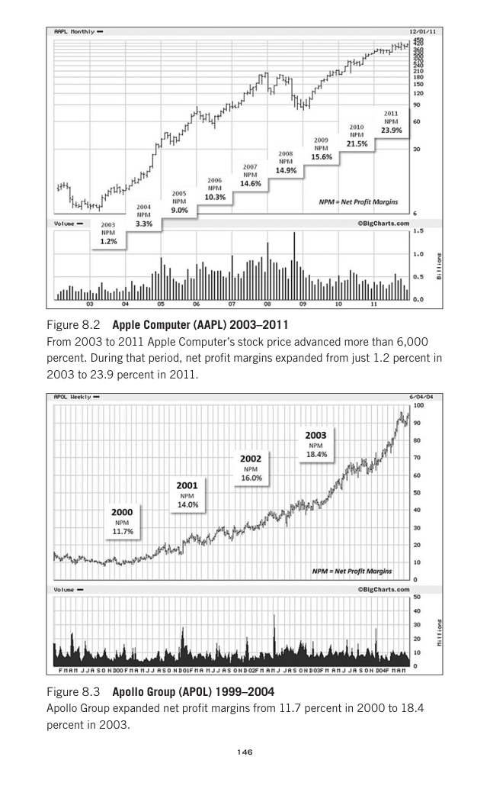

# Trade Like a Stock Market Wizard - Page Image 161

## Source Page

Book: [[Trade Like a Stock Market Wizard]]

## Page Read

Tags: manual-review-needed, stage-2-leadership, stock-chart-page, vcp-or-tightening, volume-dry-up

Concepts: [[Mental Discipline]], [[Pivot and Entry]], [[Relative Strength Leadership]], [[Stage 2 Uptrend]], [[Trend Template]], [[Volatility Contraction Pattern]], [[Volume Dry-Up and Accumulation]]

This page contains one or more stock-chart figures already reconciled in the stock-image layer. Study the source page first for the visual lesson, then open the linked case notes to compare it against rebuilt OHLCV data.

## Linked Stock Figures

- [[Trade Like a Stock Market Wizard - Figure 8-2 - AAPL - page 161]] - AAPL - vcp-or-tightening; volume-dry-up; stage-2-leadership
- [[Trade Like a Stock Market Wizard - Figure 8-3 - APOL - page 161]] - APOL - manual-review-needed

## Extracted Page Text Signal

146 Figure 8.2 Apple Computer (AAPL) 2003-2011 From 2003 to 2011 Apple Computer’s stock price advanced more than 6,000 percent. During that period, net profit margins expanded from just 1.2 percent in 2003 to 23.9 percent in 2011. Figure 8.3 Apollo Group (APOL) 1999-2004 Apollo Group expanded net profit margins from 11.7 percent in 2000 to 18.4 percent in 2003

## Manual Study Prompt

- What visual structure is the page trying to make obvious?
- Is the lesson about buying, avoiding, selling, or managing risk?
- If a ticker is not present, what generic behavior does the image teach?
- If a ticker is present, does the linked OHLCV rebuild confirm the same behavior?
