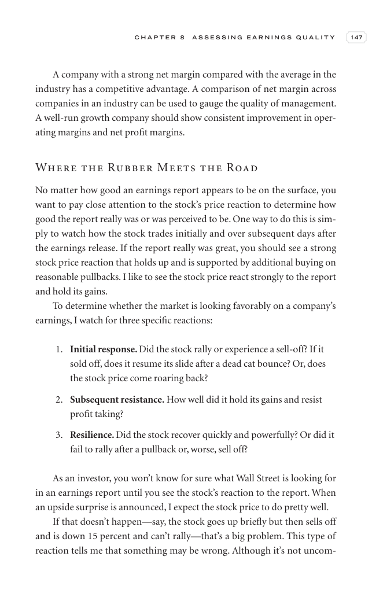

# Trade Like a Stock Market Wizard - Page Image 162

## Source Page

Book: [[Trade Like a Stock Market Wizard]]

## Page Read

Tags: sell-or-failure, visual-concept-page

Concepts: [[Mental Discipline]], [[Sell Rules and Failure Signals]]

This is a visual teaching page without a clean ticker/date case. The useful work is to read the image as a concept illustration rather than forcing a market-data reconstruction.

## Linked Stock Figures

- No extracted stock-figure case on this page.

## Extracted Page Text Signal

C H A P T E R 8 A S S E S S I N G E A R N I N G S Q U A L I T Y 147 A company with a strong net margin compared with the average in the industry has a competitive advantage. A comparison of net margin across companies in an industry can be used to gauge the quality of management. A well-run growth company should show consistent improvement in oper- ating margins and net profit margins. Where the Rubber Meets the Road No matter how good an earnings report appears to be on the surface, you want to ...

## Manual Study Prompt

- What visual structure is the page trying to make obvious?
- Is the lesson about buying, avoiding, selling, or managing risk?
- If a ticker is not present, what generic behavior does the image teach?
- If a ticker is present, does the linked OHLCV rebuild confirm the same behavior?
