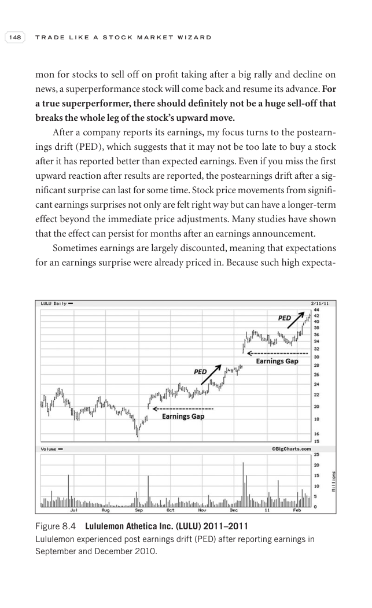

# Trade Like a Stock Market Wizard - Page Image 163

## Source Page

Book: [[Trade Like a Stock Market Wizard]]

## Page Read

Tags: sell-or-failure, stage-2-leadership, stock-chart-page, vcp-or-tightening

Concepts: [[Pivot and Entry]], [[Relative Strength Leadership]], [[Sell Rules and Failure Signals]], [[Stage 2 Uptrend]], [[Trend Template]], [[Volatility Contraction Pattern]], [[Volume Dry-Up and Accumulation]]

This page contains one or more stock-chart figures already reconciled in the stock-image layer. Study the source page first for the visual lesson, then open the linked case notes to compare it against rebuilt OHLCV data.

## Linked Stock Figures

- [[Trade Like a Stock Market Wizard - Figure 8-4 - LULU - page 163]] - LULU - vcp-or-tightening; stage-2-leadership

## Extracted Page Text Signal

148 T R A D E L I K E A S T O C K M A R K E T W I Z A R D mon for stocks to sell off on profit taking after a big rally and decline on news, a superperformance stock will come back and resume its advance. For a true superperformer, there should definitely not be a huge sell-off that breaks the whole leg of the stock’s upward move. After a company reports its earnings, my focus turns to the postearn- ings drift (PED), which suggests that it may not be too late to buy a stock after it has reported b...

## Manual Study Prompt

- What visual structure is the page trying to make obvious?
- Is the lesson about buying, avoiding, selling, or managing risk?
- If a ticker is not present, what generic behavior does the image teach?
- If a ticker is present, does the linked OHLCV rebuild confirm the same behavior?
