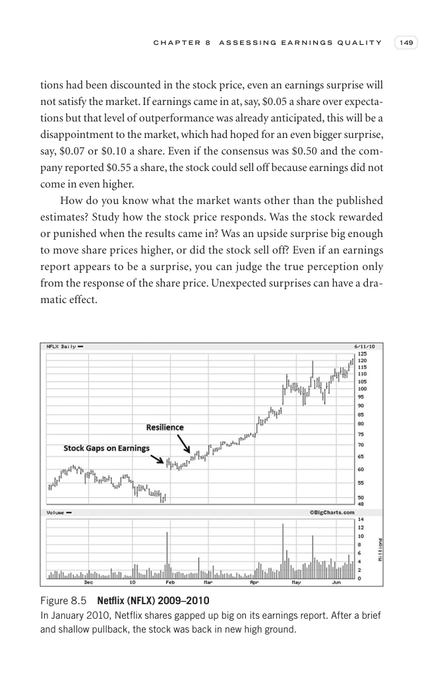

# Trade Like a Stock Market Wizard - Page Image 164

## Source Page

Book: [[Trade Like a Stock Market Wizard]]

## Page Read

Tags: sell-or-failure, stage-2-leadership, stock-chart-page, vcp-or-tightening

Concepts: [[Pivot and Entry]], [[Relative Strength Leadership]], [[Sell Rules and Failure Signals]], [[Stage 2 Uptrend]], [[Trend Template]], [[Volatility Contraction Pattern]], [[Volume Dry-Up and Accumulation]]

This page contains one or more stock-chart figures already reconciled in the stock-image layer. Study the source page first for the visual lesson, then open the linked case notes to compare it against rebuilt OHLCV data.

## Linked Stock Figures

- [[Trade Like a Stock Market Wizard - Figure 8-5 - NFLX - page 164]] - NFLX - vcp-or-tightening; stage-2-leadership

## Extracted Page Text Signal

C H A P T E R 8 A S S E S S I N G E A R N I N G S Q U A L I T Y 149 tions had been discounted in the stock price, even an earnings surprise will not satisfy the market. If earnings came in at, say, $0.05 a share over expecta- tions but that level of outperformance was already anticipated, this will be a disappointment to the market, which had hoped for an even bigger surprise, say, $0.07 or $0.10 a share. Even if the consensus was $0.50 and the com- pany reported $0.55 a share, the stock could s...

## Manual Study Prompt

- What visual structure is the page trying to make obvious?
- Is the lesson about buying, avoiding, selling, or managing risk?
- If a ticker is not present, what generic behavior does the image teach?
- If a ticker is present, does the linked OHLCV rebuild confirm the same behavior?
