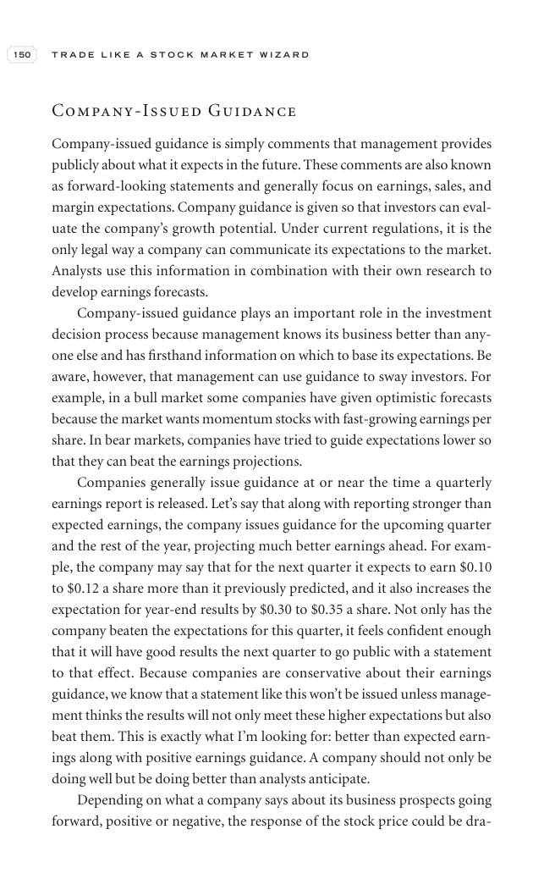

# Trade Like a Stock Market Wizard - Page Image 165

## Source Page

Book: [[Trade Like a Stock Market Wizard]]

## Page Read

Tags: visual-concept-page

Concepts: [[Mental Discipline]]

This is a visual teaching page without a clean ticker/date case. The useful work is to read the image as a concept illustration rather than forcing a market-data reconstruction.

## Linked Stock Figures

- No extracted stock-figure case on this page.

## Extracted Page Text Signal

150 T R A D E L I K E A S T O C K M A R K E T W I Z A R D Company-Issued Guidance Company-issued guidance is simply comments that management provides publicly about what it expects in the future. These comments are also known as forward-looking statements and generally focus on earnings, sales, and margin expectations. Company guidance is given so that investors can eval- uate the company’s growth potential. Under current regulations, it is the only legal way a company can communicate its expect...

## Manual Study Prompt

- What visual structure is the page trying to make obvious?
- Is the lesson about buying, avoiding, selling, or managing risk?
- If a ticker is not present, what generic behavior does the image teach?
- If a ticker is present, does the linked OHLCV rebuild confirm the same behavior?
