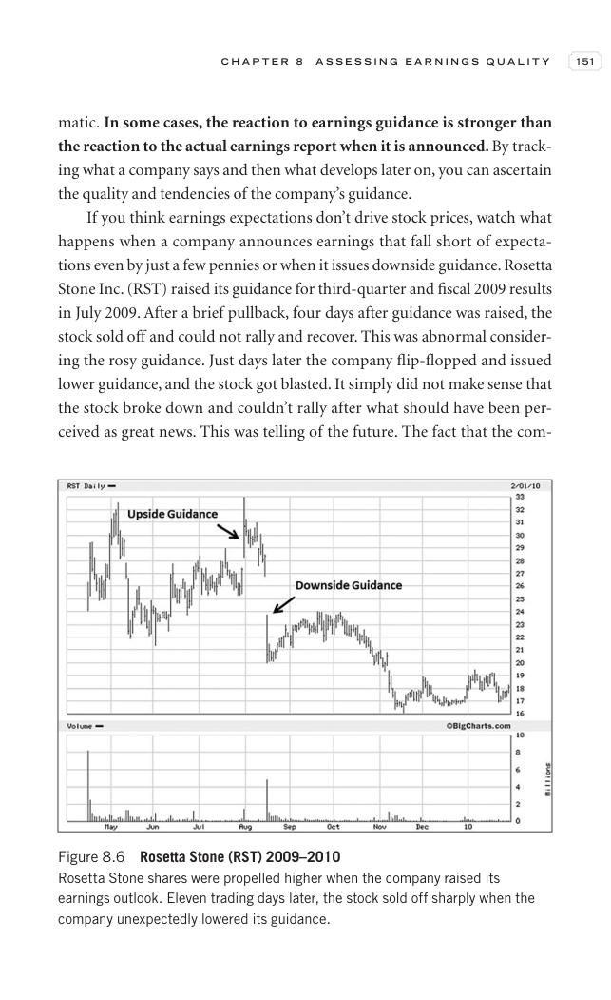

# Trade Like a Stock Market Wizard - Page Image 166

## Source Page

Book: [[Trade Like a Stock Market Wizard]]

## Page Read

Tags: manual-review-needed, stock-chart-page

Concepts: [[Mental Discipline]]

This page contains one or more stock-chart figures already reconciled in the stock-image layer. Study the source page first for the visual lesson, then open the linked case notes to compare it against rebuilt OHLCV data.

## Linked Stock Figures

- [[Trade Like a Stock Market Wizard - Figure 8-6 - RST - page 166]] - RST - manual-review-needed

## Extracted Page Text Signal

C H A P T E R 8 A S S E S S I N G E A R N I N G S Q U A L I T Y 151 matic. In some cases, the reaction to earnings guidance is stronger than the reaction to the actual earnings report when it is announced. By track- ing what a company says and then what develops later on, you can ascertain the quality and tendencies of the company’s guidance. If you think earnings expectations don’t drive stock prices, watch what happens when a company announces earnings that fall short of expecta- tions even by...

## Manual Study Prompt

- What visual structure is the page trying to make obvious?
- Is the lesson about buying, avoiding, selling, or managing risk?
- If a ticker is not present, what generic behavior does the image teach?
- If a ticker is present, does the linked OHLCV rebuild confirm the same behavior?
