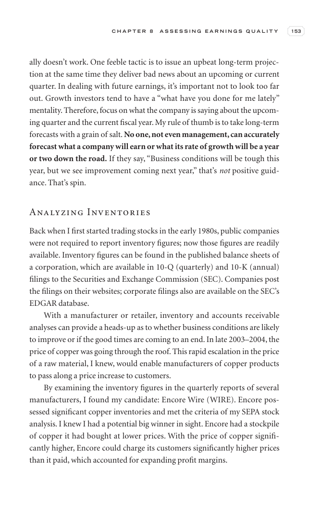

# Trade Like a Stock Market Wizard - Page Image 168

## Source Page

Book: [[Trade Like a Stock Market Wizard]]

## Page Read

Tags: visual-concept-page

Concepts: [[Mental Discipline]]

This is a visual teaching page without a clean ticker/date case. The useful work is to read the image as a concept illustration rather than forcing a market-data reconstruction.

## Linked Stock Figures

- No extracted stock-figure case on this page.

## Extracted Page Text Signal

C H A P T E R 8 A S S E S S I N G E A R N I N G S Q U A L I T Y 153 ally doesn’t work. One feeble tactic is to issue an upbeat long-term projec- tion at the same time they deliver bad news about an upcoming or current quarter. In dealing with future earnings, it’s important not to look too far out. Growth investors tend to have a “what have you done for me lately” mentality. Therefore, focus on what the company is saying about the upcom- ing quarter and the current fiscal year. My rule of thumb i...

## Manual Study Prompt

- What visual structure is the page trying to make obvious?
- Is the lesson about buying, avoiding, selling, or managing risk?
- If a ticker is not present, what generic behavior does the image teach?
- If a ticker is present, does the linked OHLCV rebuild confirm the same behavior?
