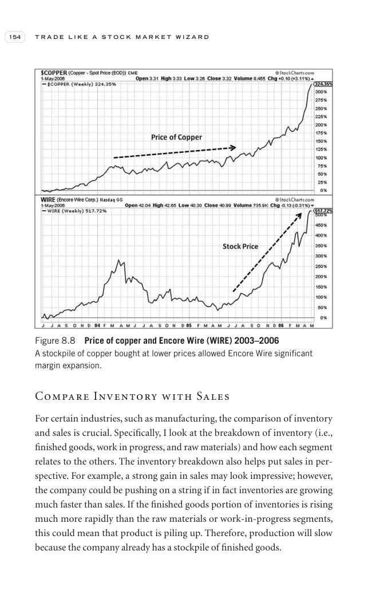

# Trade Like a Stock Market Wizard - Page Image 169

## Source Page

Book: [[Trade Like a Stock Market Wizard]]

## Page Read

Tags: manual-review-needed, stock-chart-page

Concepts: [[Mental Discipline]]

This page contains one or more stock-chart figures already reconciled in the stock-image layer. Study the source page first for the visual lesson, then open the linked case notes to compare it against rebuilt OHLCV data.

## Linked Stock Figures

- [[Trade Like a Stock Market Wizard - Figure 8-8 - WIRE - page 169]] - WIRE - manual-review-needed

## Extracted Page Text Signal

154 T R A D E L I K E A S T O C K M A R K E T W I Z A R D Compare Inventory with Sales For certain industries, such as manufacturing, the comparison of inventory and sales is crucial. Specifically, I look at the breakdown of inventory (i.e., finished goods, work in progress, and raw materials) and how each segment relates to the others. The inventory breakdown also helps put sales in per- spective. For example, a strong gain in sales may look impressive; however, the company could be pushing on a ...

## Manual Study Prompt

- What visual structure is the page trying to make obvious?
- Is the lesson about buying, avoiding, selling, or managing risk?
- If a ticker is not present, what generic behavior does the image teach?
- If a ticker is present, does the linked OHLCV rebuild confirm the same behavior?
