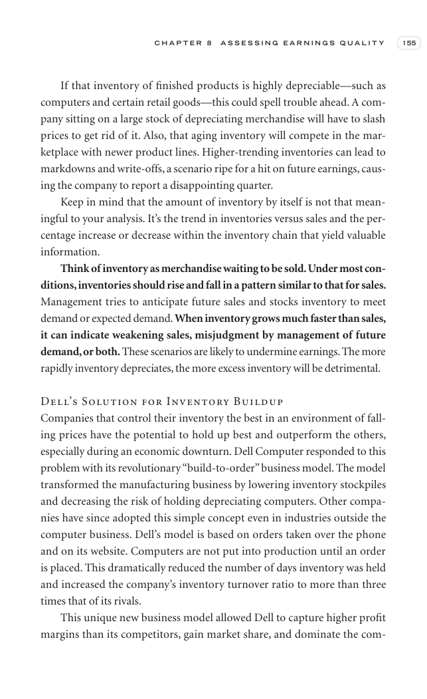

# Trade Like a Stock Market Wizard - Page Image 170

## Source Page

Book: [[Trade Like a Stock Market Wizard]]

## Page Read

Tags: visual-concept-page

Concepts: [[Mental Discipline]]

This is a visual teaching page without a clean ticker/date case. The useful work is to read the image as a concept illustration rather than forcing a market-data reconstruction.

## Linked Stock Figures

- No extracted stock-figure case on this page.

## Extracted Page Text Signal

C H A P T E R 8 A S S E S S I N G E A R N I N G S Q U A L I T Y 155 If that inventory of finished products is highly depreciable-such as computers and certain retail goods-this could spell trouble ahead. A com- pany sitting on a large stock of depreciating merchandise will have to slash prices to get rid of it. Also, that aging inventory will compete in the mar- ketplace with newer product lines. Higher-trending inventories can lead to markdowns and write-offs, a scenario ripe for a hit on future...

## Manual Study Prompt

- What visual structure is the page trying to make obvious?
- Is the lesson about buying, avoiding, selling, or managing risk?
- If a ticker is not present, what generic behavior does the image teach?
- If a ticker is present, does the linked OHLCV rebuild confirm the same behavior?
