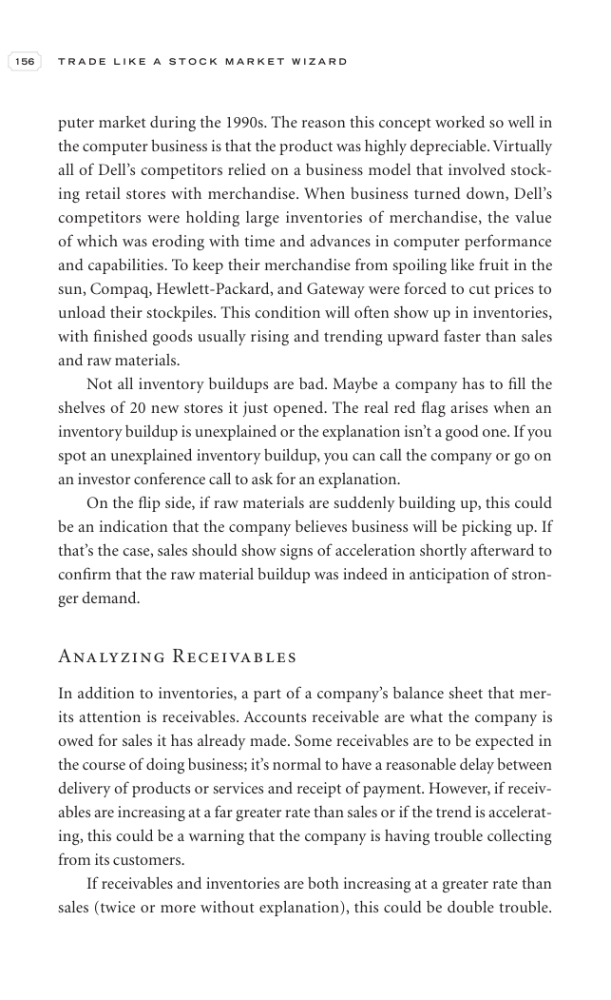

# Trade Like a Stock Market Wizard - Page Image 171

## Source Page

Book: [[Trade Like a Stock Market Wizard]]

## Page Read

Tags: visual-concept-page

Concepts: [[Mental Discipline]]

This is a visual teaching page without a clean ticker/date case. The useful work is to read the image as a concept illustration rather than forcing a market-data reconstruction.

## Linked Stock Figures

- No extracted stock-figure case on this page.

## Extracted Page Text Signal

156 T R A D E L I K E A S T O C K M A R K E T W I Z A R D puter market during the 1990s. The reason this concept worked so well in the computer business is that the product was highly depreciable. Virtually all of Dell’s competitors relied on a business model that involved stock- ing retail stores with merchandise. When business turned down, Dell’s competitors were holding large inventories of merchandise, the value of which was eroding with time and advances in computer performance and capabili...

## Manual Study Prompt

- What visual structure is the page trying to make obvious?
- Is the lesson about buying, avoiding, selling, or managing risk?
- If a ticker is not present, what generic behavior does the image teach?
- If a ticker is present, does the linked OHLCV rebuild confirm the same behavior?
