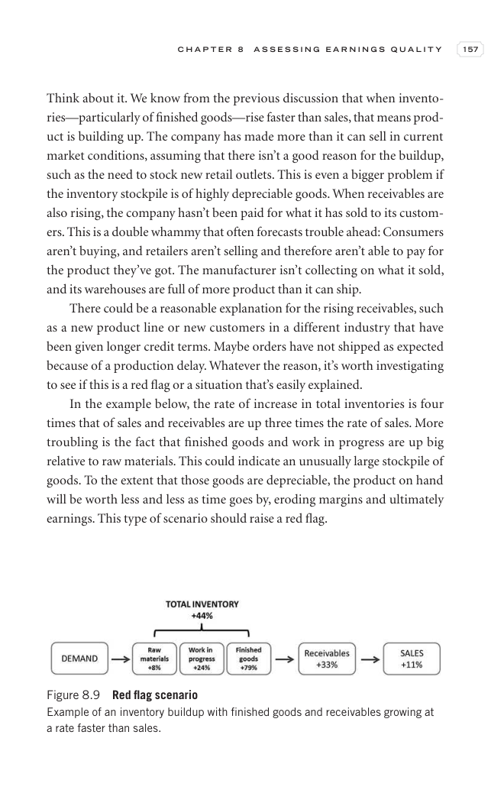

# Trade Like a Stock Market Wizard - Page Image 172

## Source Page

Book: [[Trade Like a Stock Market Wizard]]

## Page Read

Tags: manual-review-needed, sell-or-failure, stock-chart-page

Concepts: [[Mental Discipline]], [[Sell Rules and Failure Signals]]

This page contains one or more stock-chart figures already reconciled in the stock-image layer. Study the source page first for the visual lesson, then open the linked case notes to compare it against rebuilt OHLCV data.

## Linked Stock Figures

- [[Trade Like a Stock Market Wizard - Figure 8-9 - manual-review - page 172]] - manual - manual-review-needed

## Extracted Page Text Signal

C H A P T E R 8 A S S E S S I N G E A R N I N G S Q U A L I T Y 157 Think about it. We know from the previous discussion that when invento- ries-particularly of finished goods-rise faster than sales, that means prod- uct is building up. The company has made more than it can sell in current market conditions, assuming that there isn’t a good reason for the buildup, such as the need to stock new retail outlets. This is even a bigger problem if the inventory stockpile is of highly depreciable goods....

## Manual Study Prompt

- What visual structure is the page trying to make obvious?
- Is the lesson about buying, avoiding, selling, or managing risk?
- If a ticker is not present, what generic behavior does the image teach?
- If a ticker is present, does the linked OHLCV rebuild confirm the same behavior?
