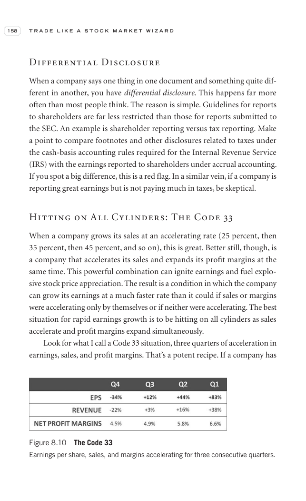

# Trade Like a Stock Market Wizard - Page Image 173

## Source Page

Book: [[Trade Like a Stock Market Wizard]]

## Page Read

Tags: manual-review-needed, stock-chart-page

Concepts: [[Mental Discipline]]

This page contains one or more stock-chart figures already reconciled in the stock-image layer. Study the source page first for the visual lesson, then open the linked case notes to compare it against rebuilt OHLCV data.

## Linked Stock Figures

- [[Trade Like a Stock Market Wizard - Figure 8-10 - manual-review - page 173]] - manual - manual-review-needed

## Extracted Page Text Signal

158 T R A D E L I K E A S T O C K M A R K E T W I Z A R D Differential Disclosure When a company says one thing in one document and something quite dif- ferent in another, you have differential disclosure. This happens far more often than most people think. The reason is simple. Guidelines for reports to shareholders are far less restricted than those for reports submitted to the SEC. An example is shareholder reporting versus tax reporting. Make a point to compare footnotes and other disclosure...

## Manual Study Prompt

- What visual structure is the page trying to make obvious?
- Is the lesson about buying, avoiding, selling, or managing risk?
- If a ticker is not present, what generic behavior does the image teach?
- If a ticker is present, does the linked OHLCV rebuild confirm the same behavior?
