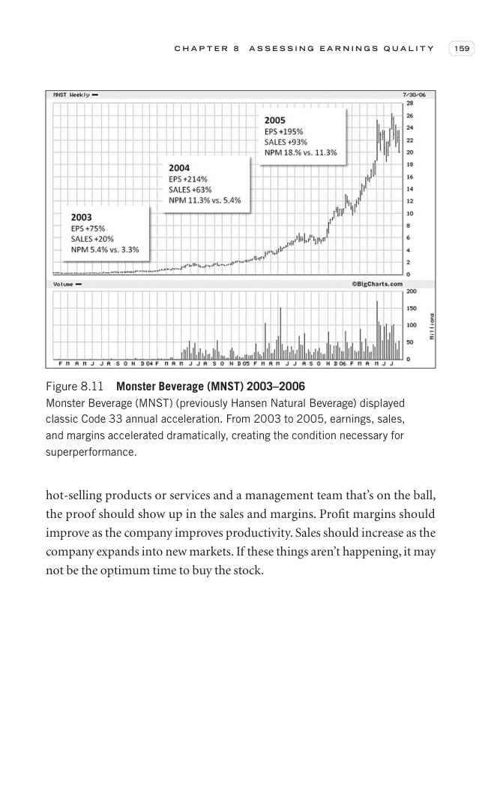

# Trade Like a Stock Market Wizard - Page Image 174

## Source Page

Book: [[Trade Like a Stock Market Wizard]]

## Page Read

Tags: sell-or-failure, stage-2-leadership, stock-chart-page, vcp-or-tightening

Concepts: [[Pivot and Entry]], [[Relative Strength Leadership]], [[Sell Rules and Failure Signals]], [[Stage 2 Uptrend]], [[Trend Template]], [[Volatility Contraction Pattern]], [[Volume Dry-Up and Accumulation]]

This page contains one or more stock-chart figures already reconciled in the stock-image layer. Study the source page first for the visual lesson, then open the linked case notes to compare it against rebuilt OHLCV data.

## Linked Stock Figures

- [[Trade Like a Stock Market Wizard - Figure 8-11 - MNST - page 174]] - MNST - vcp-or-tightening; stage-2-leadership

## Extracted Page Text Signal

C H A P T E R 8 A S S E S S I N G E A R N I N G S Q U A L I T Y 159 hot-selling products or services and a management team that’s on the ball, the proof should show up in the sales and margins. Profit margins should improve as the company improves productivity. Sales should increase as the company expands into new markets. If these things aren’t happening, it may not be the optimum time to buy the stock. Figure 8.11 Monster Beverage (MNST) 2003-2006 Monster Beverage (MNST) (previously Hansen Natu...

## Manual Study Prompt

- What visual structure is the page trying to make obvious?
- Is the lesson about buying, avoiding, selling, or managing risk?
- If a ticker is not present, what generic behavior does the image teach?
- If a ticker is present, does the linked OHLCV rebuild confirm the same behavior?
