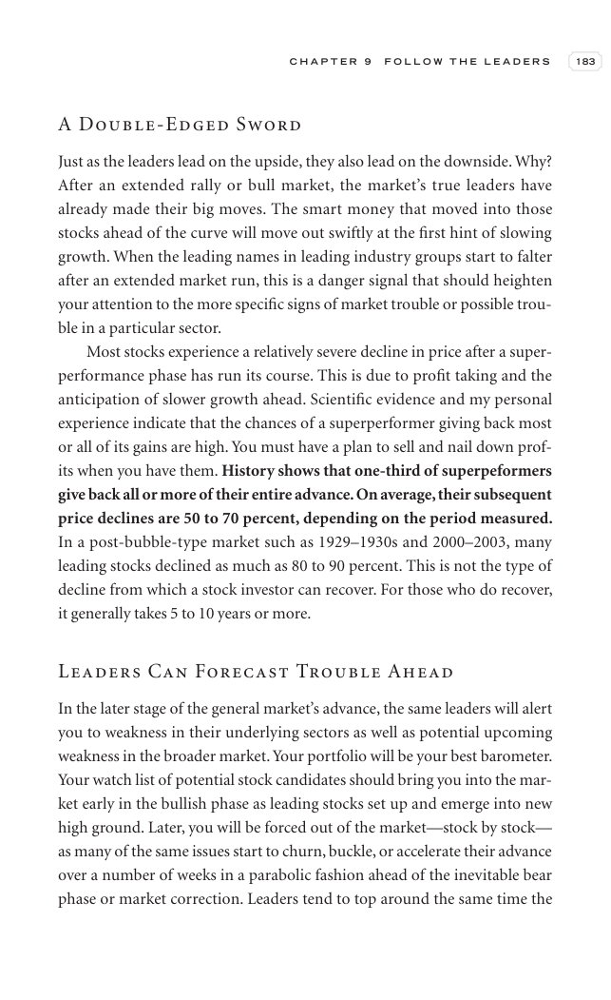

# Trade Like a Stock Market Wizard - Page Image 198

## Source Page

Book: [[Trade Like a Stock Market Wizard]]

## Page Read

Tags: sell-or-failure, visual-concept-page

Concepts: [[Mental Discipline]], [[Sell Rules and Failure Signals]]

This is a visual teaching page without a clean ticker/date case. The useful work is to read the image as a concept illustration rather than forcing a market-data reconstruction.

## Linked Stock Figures

- No extracted stock-figure case on this page.

## Extracted Page Text Signal

C H A P T E R 9 F O L L O W T H E L E A D E R S 183 A Double-Edged Sword Just as the leaders lead on the upside, they also lead on the downside. Why? After an extended rally or bull market, the market’s true leaders have already made their big moves. The smart money that moved into those stocks ahead of the curve will move out swiftly at the first hint of slowing growth. When the leading names in leading industry groups start to falter after an extended market run, this is a danger signal that sh...

## Manual Study Prompt

- What visual structure is the page trying to make obvious?
- Is the lesson about buying, avoiding, selling, or managing risk?
- If a ticker is not present, what generic behavior does the image teach?
- If a ticker is present, does the linked OHLCV rebuild confirm the same behavior?
