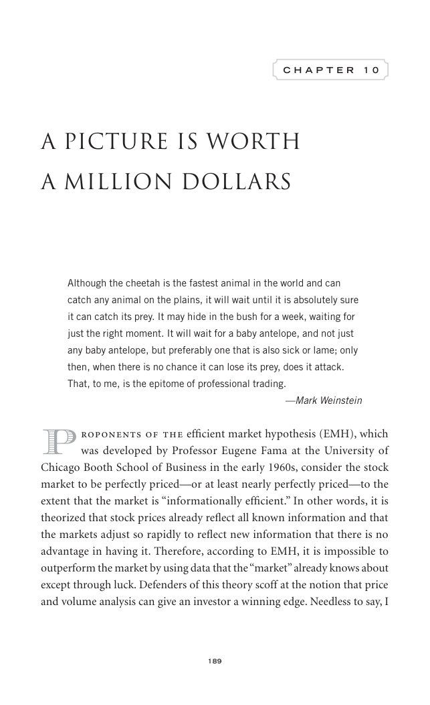

# Trade Like a Stock Market Wizard - Page Image 204

## Source Page

Book: [[Trade Like a Stock Market Wizard]]

## Page Read

Tags: visual-concept-page, volume-behavior

Concepts: [[Mental Discipline]], [[Volume Dry-Up and Accumulation]]

This is a visual teaching page without a clean ticker/date case. The useful work is to read the image as a concept illustration rather than forcing a market-data reconstruction.

## Linked Stock Figures

- No extracted stock-figure case on this page.

## Extracted Page Text Signal

189 C H A P T E R 1 0 A Picture Is Worth a Million Dollars Although the cheetah is the fastest animal in the world and can catch any animal on the plains, it will wait until it is absolutely sure it can catch its prey. It may hide in the bush for a week, waiting for just the right moment. It will wait for a baby antelope, and not just any baby antelope, but preferably one that is also sick or lame; only then, when there is no chance it can lose its prey, does it attack. That, to me, is the epito...

## Manual Study Prompt

- What visual structure is the page trying to make obvious?
- Is the lesson about buying, avoiding, selling, or managing risk?
- If a ticker is not present, what generic behavior does the image teach?
- If a ticker is present, does the linked OHLCV rebuild confirm the same behavior?
