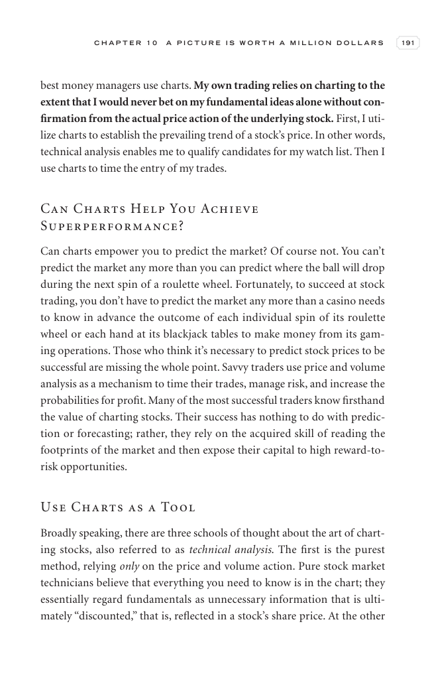

# Trade Like a Stock Market Wizard - Page Image 206

## Source Page

Book: [[Trade Like a Stock Market Wizard]]

## Page Read

Tags: risk-first, visual-concept-page, volume-behavior

Concepts: [[Mental Discipline]], [[Risk First]], [[Volume Dry-Up and Accumulation]]

This is a visual teaching page without a clean ticker/date case. The useful work is to read the image as a concept illustration rather than forcing a market-data reconstruction.

## Linked Stock Figures

- No extracted stock-figure case on this page.

## Extracted Page Text Signal

C H A P T E R 1 0 A P I C T U R E I S W O R T H A M I L L I O N D O L L A R S 191 best money managers use charts. My own trading relies on charting to the extent that I would never bet on my fundamental ideas alone without con- firmation from the actual price action of the underlying stock. First, I uti- lize charts to establish the prevailing trend of a stock’s price. In other words, technical analysis enables me to qualify candidates for my watch list. Then I use charts to time the entry of my ...

## Manual Study Prompt

- What visual structure is the page trying to make obvious?
- Is the lesson about buying, avoiding, selling, or managing risk?
- If a ticker is not present, what generic behavior does the image teach?
- If a ticker is present, does the linked OHLCV rebuild confirm the same behavior?
