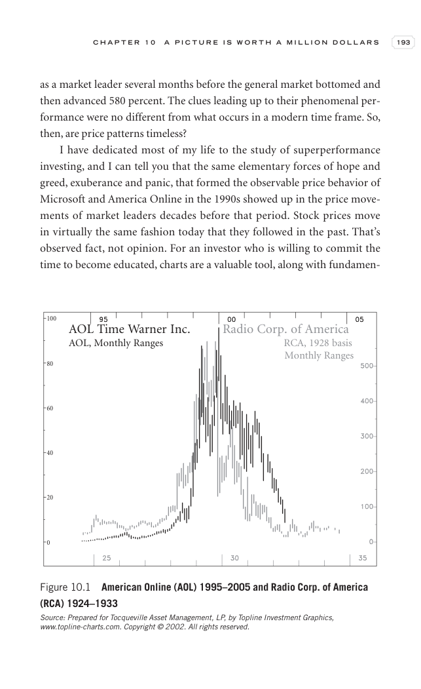

# Trade Like a Stock Market Wizard - Page Image 208

## Source Page

Book: [[Trade Like a Stock Market Wizard]]

## Page Read

Tags: manual-review-needed, stock-chart-page

Concepts: [[Mental Discipline]]

This page contains one or more stock-chart figures already reconciled in the stock-image layer. Study the source page first for the visual lesson, then open the linked case notes to compare it against rebuilt OHLCV data.

## Linked Stock Figures

- [[Trade Like a Stock Market Wizard - Figure 10-1 - AOL - page 208]] - AOL - manual-review-needed

## Extracted Page Text Signal

C H A P T E R 1 0 A P I C T U R E I S W O R T H A M I L L I O N D O L L A R S 193 as a market leader several months before the general market bottomed and then advanced 580 percent. The clues leading up to their phenomenal per- formance were no different from what occurs in a modern time frame. So, then, are price patterns timeless? I have dedicated most of my life to the study of superperformance investing, and I can tell you that the same elementary forces of hope and greed, exuberance and pan...

## Manual Study Prompt

- What visual structure is the page trying to make obvious?
- Is the lesson about buying, avoiding, selling, or managing risk?
- If a ticker is not present, what generic behavior does the image teach?
- If a ticker is present, does the linked OHLCV rebuild confirm the same behavior?
