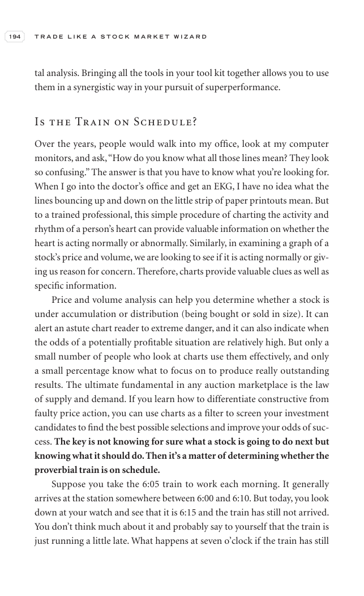

# Trade Like a Stock Market Wizard - Page Image 209

## Source Page

Book: [[Trade Like a Stock Market Wizard]]

## Page Read

Tags: visual-concept-page, volume-behavior

Concepts: [[Mental Discipline]], [[Volume Dry-Up and Accumulation]]

This is a visual teaching page without a clean ticker/date case. The useful work is to read the image as a concept illustration rather than forcing a market-data reconstruction.

## Linked Stock Figures

- No extracted stock-figure case on this page.

## Extracted Page Text Signal

194 T R A D E L I K E A S T O C K M A R K E T W I Z A R D tal analysis. Bringing all the tools in your tool kit together allows you to use them in a synergistic way in your pursuit of superperformance. Is the Train on Schedule? Over the years, people would walk into my office, look at my computer monitors, and ask, “How do you know what all those lines mean? They look so confusing.” The answer is that you have to know what you’re looking for. When I go into the doctor’s office and get an EKG, I ha...

## Manual Study Prompt

- What visual structure is the page trying to make obvious?
- Is the lesson about buying, avoiding, selling, or managing risk?
- If a ticker is not present, what generic behavior does the image teach?
- If a ticker is present, does the linked OHLCV rebuild confirm the same behavior?
