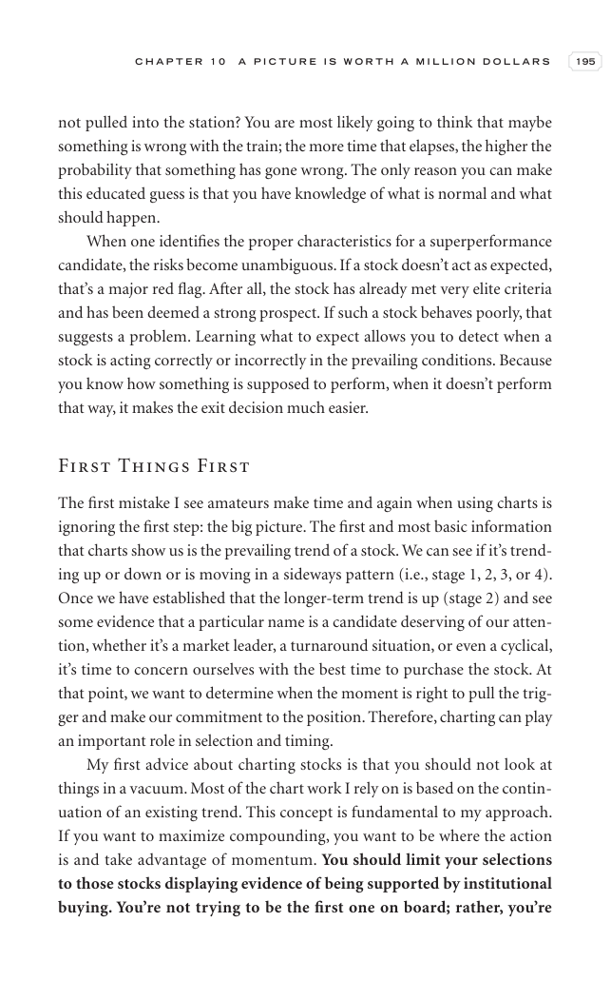

# Trade Like a Stock Market Wizard - Page Image 210

## Source Page

Book: [[Trade Like a Stock Market Wizard]]

## Page Read

Tags: mental-discipline, risk-first, stage-2-uptrend, visual-concept-page

Concepts: [[Mental Discipline]], [[Risk First]], [[Stage 2 Uptrend]]

This is a visual teaching page without a clean ticker/date case. The useful work is to read the image as a concept illustration rather than forcing a market-data reconstruction.

## Linked Stock Figures

- No extracted stock-figure case on this page.

## Extracted Page Text Signal

C H A P T E R 1 0 A P I C T U R E I S W O R T H A M I L L I O N D O L L A R S 195 not pulled into the station? You are most likely going to think that maybe something is wrong with the train; the more time that elapses, the higher the probability that something has gone wrong. The only reason you can make this educated guess is that you have knowledge of what is normal and what should happen. When one identifies the proper characteristics for a superperformance candidate, the risks become unambig...

## Manual Study Prompt

- What visual structure is the page trying to make obvious?
- Is the lesson about buying, avoiding, selling, or managing risk?
- If a ticker is not present, what generic behavior does the image teach?
- If a ticker is present, does the linked OHLCV rebuild confirm the same behavior?
