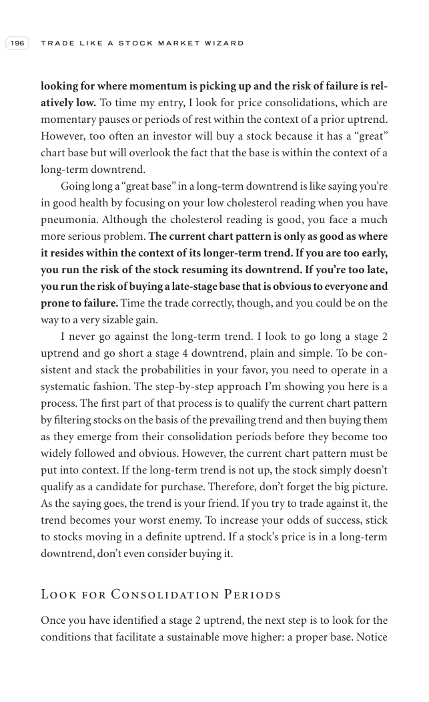

# Trade Like a Stock Market Wizard - Page Image 211

## Source Page

Book: [[Trade Like a Stock Market Wizard]]

## Page Read

Tags: risk-first, sell-or-failure, stage-2-uptrend, visual-concept-page

Concepts: [[Mental Discipline]], [[Risk First]], [[Sell Rules and Failure Signals]], [[Stage 2 Uptrend]]

This is a visual teaching page without a clean ticker/date case. The useful work is to read the image as a concept illustration rather than forcing a market-data reconstruction.

## Linked Stock Figures

- No extracted stock-figure case on this page.

## Extracted Page Text Signal

196 T R A D E L I K E A S T O C K M A R K E T W I Z A R D looking for where momentum is picking up and the risk of failure is rel- atively low. To time my entry, I look for price consolidations, which are momentary pauses or periods of rest within the context of a prior uptrend. However, too often an investor will buy a stock because it has a “great” chart base but will overlook the fact that the base is within the context of a long-term downtrend. Going long a “great base” in a long-term downtr...

## Manual Study Prompt

- What visual structure is the page trying to make obvious?
- Is the lesson about buying, avoiding, selling, or managing risk?
- If a ticker is not present, what generic behavior does the image teach?
- If a ticker is present, does the linked OHLCV rebuild confirm the same behavior?
