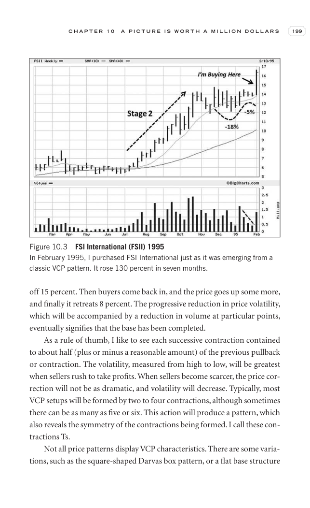

# Trade Like a Stock Market Wizard - Page Image 214

## Source Page

Book: [[Trade Like a Stock Market Wizard]]

## Page Read

Tags: manual-review-needed, sell-or-failure, stock-chart-page, vcp-or-tightening, volume-behavior

Concepts: [[Mental Discipline]], [[Sell Rules and Failure Signals]], [[Volatility Contraction Pattern]], [[Volume Dry-Up and Accumulation]]

This page contains one or more stock-chart figures already reconciled in the stock-image layer. Study the source page first for the visual lesson, then open the linked case notes to compare it against rebuilt OHLCV data.

## Linked Stock Figures

- [[Trade Like a Stock Market Wizard - Figure 10-3 - FSII - page 214]] - FSII - manual-review-needed

## Extracted Page Text Signal

C H A P T E R 1 0 A P I C T U R E I S W O R T H A M I L L I O N D O L L A R S 199 off 15 percent. Then buyers come back in, and the price goes up some more, and finally it retreats 8 percent. The progressive reduction in price volatility, which will be accompanied by a reduction in volume at particular points, eventually signifies that the base has been completed. As a rule of thumb, I like to see each successive contraction contained to about half (plus or minus a reasonable amount) of the previo...

## Manual Study Prompt

- What visual structure is the page trying to make obvious?
- Is the lesson about buying, avoiding, selling, or managing risk?
- If a ticker is not present, what generic behavior does the image teach?
- If a ticker is present, does the linked OHLCV rebuild confirm the same behavior?
