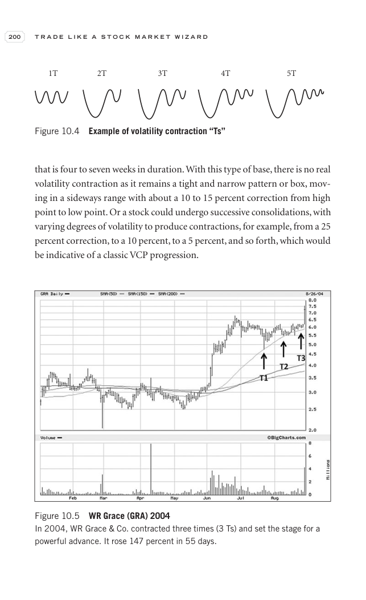

# Trade Like a Stock Market Wizard - Page Image 215

## Source Page

Book: [[Trade Like a Stock Market Wizard]]

## Page Read

Tags: manual-review-needed, stock-chart-page, vcp-or-tightening

Concepts: [[Mental Discipline]], [[Volatility Contraction Pattern]]

This page contains one or more stock-chart figures already reconciled in the stock-image layer. Study the source page first for the visual lesson, then open the linked case notes to compare it against rebuilt OHLCV data.

## Linked Stock Figures

- [[Trade Like a Stock Market Wizard - Figure 10-5 - GRA - page 215]] - GRA - manual-review-needed
- [[Trade Like a Stock Market Wizard - Figure 10-4 - manual-review - page 215]] - manual - manual-review-needed

## Extracted Page Text Signal

200 T R A D E L I K E A S T O C K M A R K E T W I Z A R D that is four to seven weeks in duration. With this type of base, there is no real volatility contraction as it remains a tight and narrow pattern or box, mov- ing in a sideways range with about a 10 to 15 percent correction from high point to low point. Or a stock could undergo successive consolidations, with varying degrees of volatility to produce contractions, for example, from a 25 percent correction, to a 10 percent, to a 5 percent, ...

## Manual Study Prompt

- What visual structure is the page trying to make obvious?
- Is the lesson about buying, avoiding, selling, or managing risk?
- If a ticker is not present, what generic behavior does the image teach?
- If a ticker is present, does the linked OHLCV rebuild confirm the same behavior?
