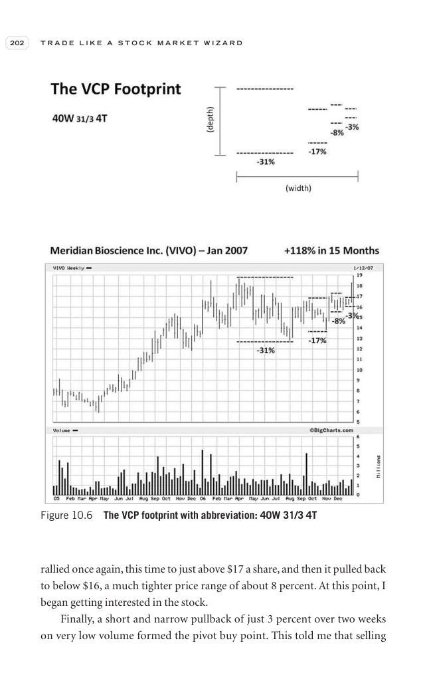

# Trade Like a Stock Market Wizard - Page Image 217

## Source Page

Book: [[Trade Like a Stock Market Wizard]]

## Page Read

Tags: manual-review-needed, pivot-or-entry, sell-or-failure, stock-chart-page, volume-behavior

Concepts: [[Mental Discipline]], [[Pivot and Entry]], [[Sell Rules and Failure Signals]], [[Volume Dry-Up and Accumulation]]

This page contains one or more stock-chart figures already reconciled in the stock-image layer. Study the source page first for the visual lesson, then open the linked case notes to compare it against rebuilt OHLCV data.

## Linked Stock Figures

- [[Trade Like a Stock Market Wizard - Figure 10-6 - manual-review - page 217]] - manual - manual-review-needed

## Extracted Page Text Signal

202 T R A D E L I K E A S T O C K M A R K E T W I Z A R D rallied once again, this time to just above $17 a share, and then it pulled back to below $16, a much tighter price range of about 8 percent. At this point, I began getting interested in the stock. Finally, a short and narrow pullback of just 3 percent over two weeks on very low volume formed the pivot buy point. This told me that selling Figure 10.6 The VCP footprint with abbreviation: 40W 31/3 4T

## Manual Study Prompt

- What visual structure is the page trying to make obvious?
- Is the lesson about buying, avoiding, selling, or managing risk?
- If a ticker is not present, what generic behavior does the image teach?
- If a ticker is present, does the linked OHLCV rebuild confirm the same behavior?
