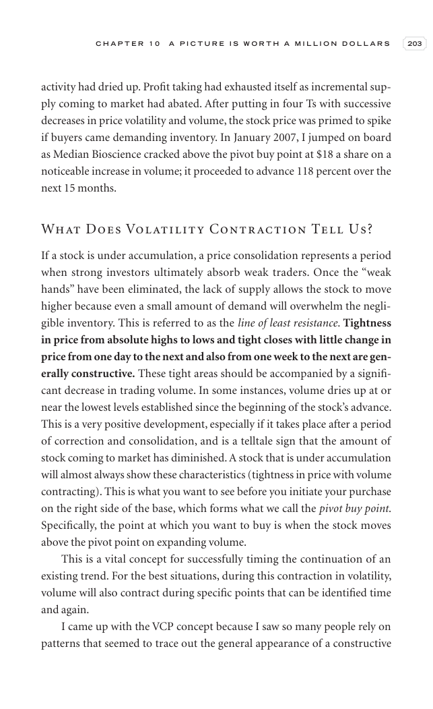

# Trade Like a Stock Market Wizard - Page Image 218

## Source Page

Book: [[Trade Like a Stock Market Wizard]]

## Page Read

Tags: pivot-or-entry, vcp-or-tightening, visual-concept-page, volume-behavior

Concepts: [[Mental Discipline]], [[Pivot and Entry]], [[Volatility Contraction Pattern]], [[Volume Dry-Up and Accumulation]]

This is a visual teaching page without a clean ticker/date case. The useful work is to read the image as a concept illustration rather than forcing a market-data reconstruction.

## Linked Stock Figures

- No extracted stock-figure case on this page.

## Extracted Page Text Signal

C H A P T E R 1 0 A P I C T U R E I S W O R T H A M I L L I O N D O L L A R S 203 activity had dried up. Profit taking had exhausted itself as incremental sup- ply coming to market had abated. After putting in four Ts with successive decreases in price volatility and volume, the stock price was primed to spike if buyers came demanding inventory. In January 2007, I jumped on board as Median Bioscience cracked above the pivot buy point at $18 a share on a noticeable increase in volume; it proceeded...

## Manual Study Prompt

- What visual structure is the page trying to make obvious?
- Is the lesson about buying, avoiding, selling, or managing risk?
- If a ticker is not present, what generic behavior does the image teach?
- If a ticker is present, does the linked OHLCV rebuild confirm the same behavior?
