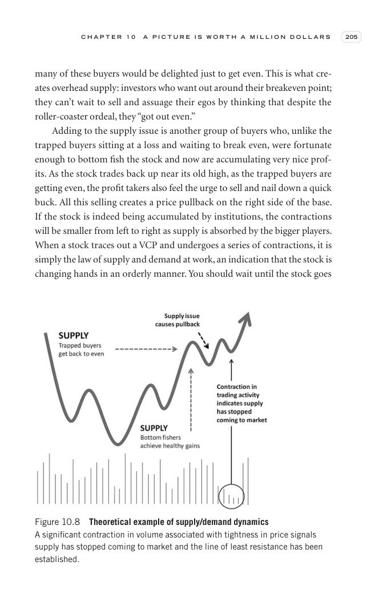

# Trade Like a Stock Market Wizard - Page Image 220

## Source Page

Book: [[Trade Like a Stock Market Wizard]]

## Page Read

Tags: manual-review-needed, risk-first, sell-or-failure, stock-chart-page, vcp-or-tightening, volume-behavior

Concepts: [[Mental Discipline]], [[Risk First]], [[Sell Rules and Failure Signals]], [[Volatility Contraction Pattern]], [[Volume Dry-Up and Accumulation]]

This page contains one or more stock-chart figures already reconciled in the stock-image layer. Study the source page first for the visual lesson, then open the linked case notes to compare it against rebuilt OHLCV data.

## Linked Stock Figures

- [[Trade Like a Stock Market Wizard - Figure 10-8 - manual-review - page 220]] - manual - manual-review-needed

## Extracted Page Text Signal

C H A P T E R 1 0 A P I C T U R E I S W O R T H A M I L L I O N D O L L A R S 205 many of these buyers would be delighted just to get even. This is what cre- ates overhead supply: investors who want out around their breakeven point; they can’t wait to sell and assuage their egos by thinking that despite the roller-coaster ordeal, they “got out even.” Adding to the supply issue is another group of buyers who, unlike the trapped buyers sitting at a loss and waiting to break even, were fortunate en...

## Manual Study Prompt

- What visual structure is the page trying to make obvious?
- Is the lesson about buying, avoiding, selling, or managing risk?
- If a ticker is not present, what generic behavior does the image teach?
- If a ticker is present, does the linked OHLCV rebuild confirm the same behavior?
