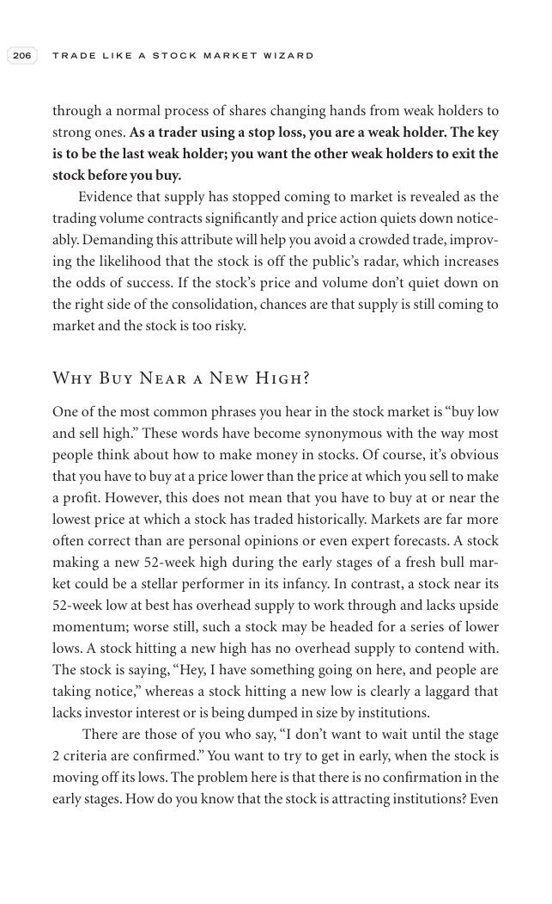

# Trade Like a Stock Market Wizard - Page Image 221

## Source Page

Book: [[Trade Like a Stock Market Wizard]]

## Page Read

Tags: risk-first, sell-or-failure, visual-concept-page, volume-behavior

Concepts: [[Mental Discipline]], [[Risk First]], [[Sell Rules and Failure Signals]], [[Volume Dry-Up and Accumulation]]

This is a visual teaching page without a clean ticker/date case. The useful work is to read the image as a concept illustration rather than forcing a market-data reconstruction.

## Linked Stock Figures

- No extracted stock-figure case on this page.

## Extracted Page Text Signal

206 T R A D E L I K E A S T O C K M A R K E T W I Z A R D through a normal process of shares changing hands from weak holders to strong ones. As a trader using a stop loss, you are a weak holder. The key is to be the last weak holder; you want the other weak holders to exit the stock before you buy. Evidence that supply has stopped coming to market is revealed as the trading volume contracts significantly and price action quiets down notice- ably. Demanding this attribute will help you avoid a cr...

## Manual Study Prompt

- What visual structure is the page trying to make obvious?
- Is the lesson about buying, avoiding, selling, or managing risk?
- If a ticker is not present, what generic behavior does the image teach?
- If a ticker is present, does the linked OHLCV rebuild confirm the same behavior?
