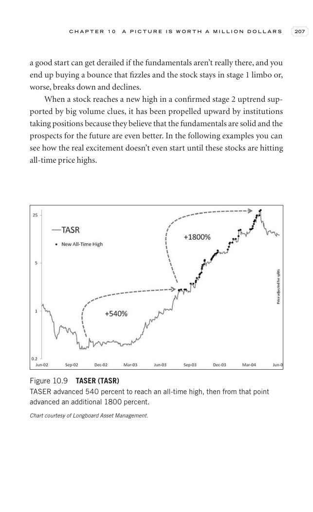

# Trade Like a Stock Market Wizard - Page Image 222

## Source Page

Book: [[Trade Like a Stock Market Wizard]]

## Page Read

Tags: manual-review-needed, stage-2-uptrend, stock-chart-page, volume-behavior

Concepts: [[Mental Discipline]], [[Stage 2 Uptrend]], [[Volume Dry-Up and Accumulation]]

This page contains one or more stock-chart figures already reconciled in the stock-image layer. Study the source page first for the visual lesson, then open the linked case notes to compare it against rebuilt OHLCV data.

## Linked Stock Figures

- [[Trade Like a Stock Market Wizard - Figure 10-9 - TASR - page 222]] - TASR - manual-review-needed

## Extracted Page Text Signal

C H A P T E R 1 0 A P I C T U R E I S W O R T H A M I L L I O N D O L L A R S 207 a good start can get derailed if the fundamentals aren’t really there, and you end up buying a bounce that fizzles and the stock stays in stage 1 limbo or, worse, breaks down and declines. When a stock reaches a new high in a confirmed stage 2 uptrend sup- ported by big volume clues, it has been propelled upward by institutions taking positions because they believe that the fundamentals are solid and the prospects fo...

## Manual Study Prompt

- What visual structure is the page trying to make obvious?
- Is the lesson about buying, avoiding, selling, or managing risk?
- If a ticker is not present, what generic behavior does the image teach?
- If a ticker is present, does the linked OHLCV rebuild confirm the same behavior?
