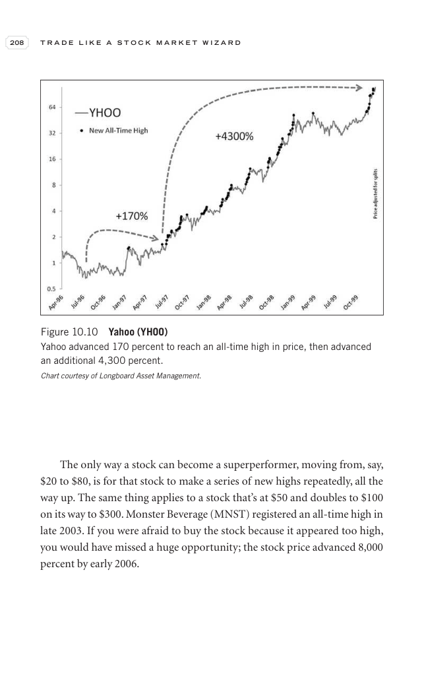

# Trade Like a Stock Market Wizard - Page Image 223

## Source Page

Book: [[Trade Like a Stock Market Wizard]]

## Page Read

Tags: manual-review-needed, stock-chart-page

Concepts: [[Mental Discipline]]

This page contains one or more stock-chart figures already reconciled in the stock-image layer. Study the source page first for the visual lesson, then open the linked case notes to compare it against rebuilt OHLCV data.

## Linked Stock Figures

- [[Trade Like a Stock Market Wizard - Figure 10-10 - YHOO - page 223]] - YHOO - manual-review-needed

## Extracted Page Text Signal

208 T R A D E L I K E A S T O C K M A R K E T W I Z A R D The only way a stock can become a superperformer, moving from, say, $20 to $80, is for that stock to make a series of new highs repeatedly, all the way up. The same thing applies to a stock that’s at $50 and doubles to $100 on its way to $300. Monster Beverage (MNST) registered an all-time high in late 2003. If you were afraid to buy the stock because it appeared too high, you would have missed a huge opportunity; the stock price advanced...

## Manual Study Prompt

- What visual structure is the page trying to make obvious?
- Is the lesson about buying, avoiding, selling, or managing risk?
- If a ticker is not present, what generic behavior does the image teach?
- If a ticker is present, does the linked OHLCV rebuild confirm the same behavior?
