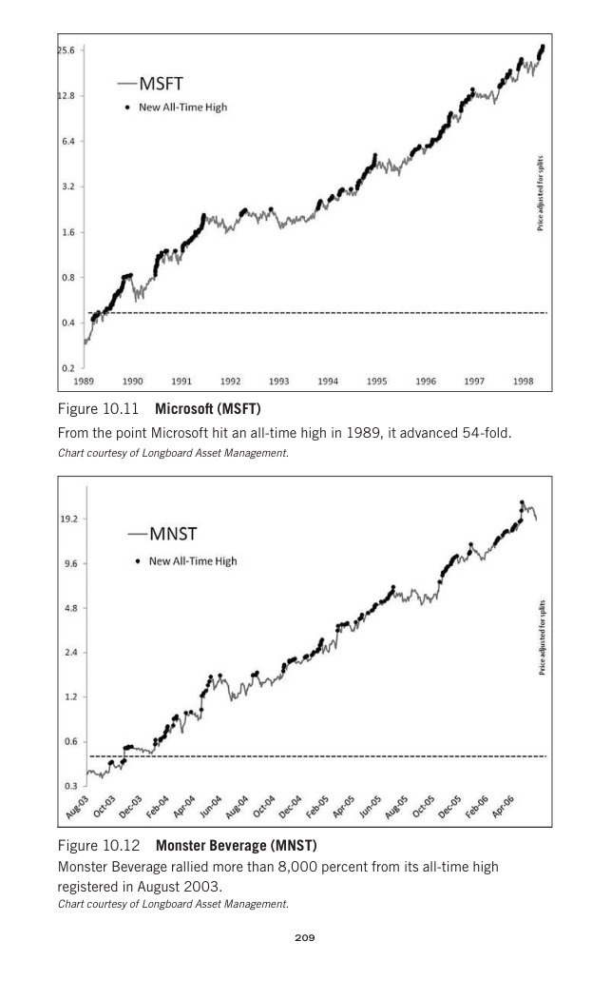

# Trade Like a Stock Market Wizard - Page Image 224

## Source Page

Book: [[Trade Like a Stock Market Wizard]]

## Page Read

Tags: stage-2-leadership, stock-chart-page, volume-dry-up

Concepts: [[Relative Strength Leadership]], [[Stage 2 Uptrend]], [[Trend Template]], [[Volume Dry-Up and Accumulation]]

This page contains one or more stock-chart figures already reconciled in the stock-image layer. Study the source page first for the visual lesson, then open the linked case notes to compare it against rebuilt OHLCV data.

## Linked Stock Figures

- [[Trade Like a Stock Market Wizard - Figure 10-11 - MSFT - page 224]] - MSFT - volume-dry-up; stage-2-leadership
- [[Trade Like a Stock Market Wizard - Figure 10-12 - MNST - page 224]] - MNST - stage-2-leadership

## Extracted Page Text Signal

209 Figure 10.11 Microsoft (MSFT) From the point Microsoft hit an all-time high in 1989, it advanced 54-fold. Chart courtesy of Longboard Asset Management. Figure 10.12 Monster Beverage (MNST) Monster Beverage rallied more than 8,000 percent from its all-time high registered in August 2003. Chart courtesy of Longboard Asset Management

## Manual Study Prompt

- What visual structure is the page trying to make obvious?
- Is the lesson about buying, avoiding, selling, or managing risk?
- If a ticker is not present, what generic behavior does the image teach?
- If a ticker is present, does the linked OHLCV rebuild confirm the same behavior?
