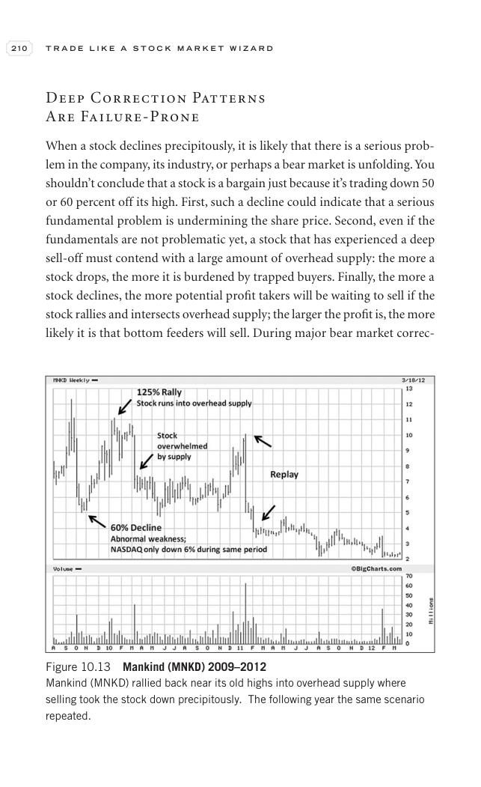

# Trade Like a Stock Market Wizard - Page Image 225

## Source Page

Book: [[Trade Like a Stock Market Wizard]]

## Page Read

Tags: sell-or-failure, stage-2-leadership, stock-chart-page

Concepts: [[Relative Strength Leadership]], [[Sell Rules and Failure Signals]], [[Stage 2 Uptrend]], [[Trend Template]]

This page contains one or more stock-chart figures already reconciled in the stock-image layer. Study the source page first for the visual lesson, then open the linked case notes to compare it against rebuilt OHLCV data.

## Linked Stock Figures

- [[Trade Like a Stock Market Wizard - Figure 10-13 - MNKD - page 225]] - MNKD - stage-2-leadership

## Extracted Page Text Signal

210 T R A D E L I K E A S T O C K M A R K E T W I Z A R D Deep Correction Patterns Are Failure-Prone When a stock declines precipitously, it is likely that there is a serious prob- lem in the company, its industry, or perhaps a bear market is unfolding. You shouldn’t conclude that a stock is a bargain just because it’s trading down 50 or 60 percent off its high. First, such a decline could indicate that a serious fundamental problem is undermining the share price. Second, even if the fundamental...

## Manual Study Prompt

- What visual structure is the page trying to make obvious?
- Is the lesson about buying, avoiding, selling, or managing risk?
- If a ticker is not present, what generic behavior does the image teach?
- If a ticker is present, does the linked OHLCV rebuild confirm the same behavior?
